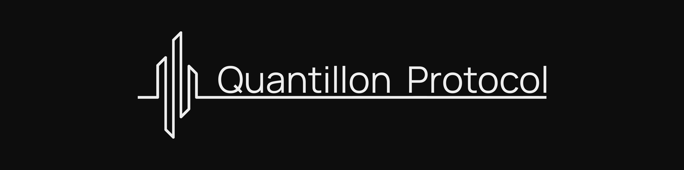

# Smart Contracts - Quantillon Protocol

<div align="center">
  
</div>

[](https://opensource.org/licenses/MIT)
[](https://soliditylang.org/)
[](https://getfoundry.sh/)

> **Smart Contracts Repository for Quantillon Protocol - Euro-pegged stablecoin ecosystem with dual-pool architecture**

## 📁 Repository Structure

This repository contains the complete smart contract implementation for the Quantillon Protocol. All development files are organized in the `quantillon-protocol` directory.

```
smart-contracts/
├── quantillon-protocol/          # Main project directory
│   ├── src/                     # Smart contract source code
│   │   ├── core/               # Core protocol contracts
│   │   ├── interfaces/         # Contract interfaces
│   │   ├── libraries/          # Utility libraries
│   │   └── oracle/             # Oracle integration
│   ├── test/                   # Comprehensive test suite
│   ├── scripts/                # Build and deployment scripts
│   ├── docs/                   # Generated documentation
│   ├── lib/                    # External dependencies
│   ├── foundry.toml           # Foundry configuration
│   └── README.md              # Detailed project documentation
└── README.md                   # This file
```

## 🚀 Quick Navigation

### Main Project
**[📁 quantillon-protocol/](./quantillon-protocol/)** - Complete smart contract implementation

### Key Directories
- **[📄 Source Code](./quantillon-protocol/src/)** - All smart contracts and libraries
- **[🧪 Tests](./quantillon-protocol/test/)** - Comprehensive test suite
- **[📚 Documentation](./quantillon-protocol/docs/)** - Generated documentation
- **[🔧 Scripts](./quantillon-protocol/scripts/)** - Build and deployment scripts

## 🎯 What is Quantillon Protocol?

Quantillon Protocol is a comprehensive DeFi ecosystem built around **QEURO**, a Euro-pegged stablecoin. The protocol features a dual-pool architecture that separates user deposits from hedging operations, enabling efficient yield generation while maintaining stability.

### Core Components

- **QEUROToken**: Euro-pegged stablecoin with configurable supply cap and rate limiting
- **QTIToken**: Governance token with vote-escrow mechanics and voting power multipliers
- **QuantillonVault**: Main vault for overcollateralized QEURO minting
- **UserPool**: User deposit and staking management with yield distribution
- **HedgerPool**: EUR/USD hedging operations with margin management
- **stQEUROToken**: Yield-bearing wrapper token with automatic yield accrual

### Key Features
- **Dual-pool architecture** separating user deposits from hedging operations
- **Role-based access control** for all critical operations
- **Emergency pause mechanisms** for crisis situations
- **Upgradeable architecture** via UUPS pattern
- **Oracle integration** for EUR/USD price feeds
- **Yield generation** through multiple mechanisms

## 🏃‍♂️ Getting Started

### Prerequisites
- [Foundry](https://getfoundry.sh/) (latest version)
- Git

### Quick Start
```bash
# Clone the repository
git clone https://github.com/quantillon/smart-contracts.git
cd smart-contracts

# Navigate to the main project
cd quantillon-protocol

# Install dependencies and build
forge install
forge build

# Run tests
forge test
```

## 📚 Documentation

### Generated Documentation
```bash
cd quantillon-protocol
forge doc --build
forge doc --serve
```

### Contract Documentation
- **[QEUROToken](./quantillon-protocol/docs/src/src/core/QEUROToken.sol/contract.QEUROToken.md)** - Euro-pegged stablecoin
- **[QTIToken](./quantillon-protocol/docs/src/src/core/QTIToken.sol/contract.QTIToken.md)** - Governance token
- **[QuantillonVault](./quantillon-protocol/docs/src/src/core/QuantillonVault.sol/contract.QuantillonVault.md)** - Main vault
- **[UserPool](./quantillon-protocol/docs/src/src/core/UserPool.sol/contract.UserPool.md)** - User deposits
- **[HedgerPool](./quantillon-protocol/docs/src/src/core/HedgerPool.sol/contract.HedgerPool.md)** - Hedging operations
- **[stQEUROToken](./quantillon-protocol/docs/src/src/core/stQEUROToken.sol/contract.stQEUROToken.md)** - Yield-bearing wrapper

## 🏗️ Core Contracts

| Contract | Purpose | Location |
|----------|---------|----------|
| **QEUROToken** | Euro-pegged stablecoin | `quantillon-protocol/src/core/QEUROToken.sol` |
| **QTIToken** | Governance token | `quantillon-protocol/src/core/QTIToken.sol` |
| **QuantillonVault** | Main vault | `quantillon-protocol/src/core/QuantillonVault.sol` |
| **UserPool** | User deposits | `quantillon-protocol/src/core/UserPool.sol` |
| **HedgerPool** | Hedging operations | `quantillon-protocol/src/core/HedgerPool.sol` |
| **stQEUROToken** | Yield-bearing wrapper | `quantillon-protocol/src/core/stQEUROToken.sol` |

## 🧪 Testing

```bash
cd quantillon-protocol

# Run all tests
forge test

# Run with verbose output
forge test -vvv

# Generate coverage
forge coverage
```

## 🔧 Development

```bash
cd quantillon-protocol

# Format code
forge fmt

# Build contracts
forge build

# Deploy to local network
forge script script/deploy/DeployProtocol.s.sol --rpc-url http://localhost:8545 --broadcast
```

## 🔒 Security

- **Security Contact**: `team@quantillon.money`
- **Security Features**: Role-based access control, reentrancy protection, emergency pause mechanisms
- **Security Analysis**: Integrated Slither analysis with `make slither`

For detailed security information, see the [main project README](./quantillon-protocol/README.md#security).

## 🤝 Contributing

We welcome contributions! Please see our [Contributing Guidelines](./quantillon-protocol/CONTRIBUTING.md) for details.

### Development Workflow
1. Fork the repository
2. Create a feature branch
3. Make your changes in the `quantillon-protocol` directory
4. Add tests and update documentation
5. Submit a Pull Request

## 📄 License

This project is licensed under the MIT License - see the [LICENSE](./quantillon-protocol/LICENSE) file for details.

## 🌐 Links

- **Website**: [quantillon.money](https://quantillon.money)
- **Documentation**: [docs.quantillon.money](https://docs.quantillon.money)
- **X (Twitter)**: [@QuantillonLabs](https://x.com/QuantillonLabs)
- **Discord**: [discord.gg/uk8T9GqdE5](https://discord.gg/uk8T9GqdE5)
- **Telegram**: [@QuantillonLabs](https://t.me/QuantillonLabs)

## 📖 Detailed Documentation

For comprehensive documentation, setup instructions, and development guides, please see:

**[📁 quantillon-protocol/README.md](./quantillon-protocol/README.md)**

---

**Built with ❤️ by the Quantillon Labs team**
