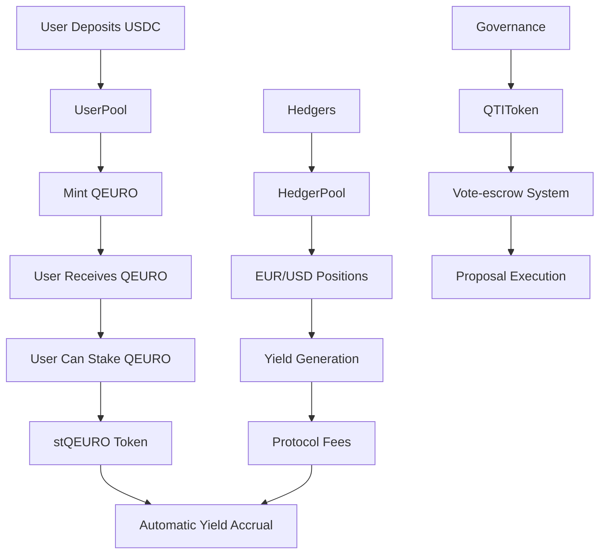

# Quantillon Protocol Smart Contracts

[](https://opensource.org/licenses/MIT)
[](https://soliditylang.org/)
[](https://getfoundry.sh/)

> **Euro-pegged stablecoin protocol with dual-pool architecture, yield generation, and governance mechanisms**

## 📖 Overview

Quantillon Protocol is a comprehensive DeFi ecosystem built around QEURO, a Euro-pegged stablecoin. The protocol features a dual-pool architecture that separates user deposits from hedging operations, enabling efficient yield generation while maintaining stability.

### 🎯 Key Features

- **Euro-Pegged Stablecoin**: QEURO maintains 1:1 peg with Euro through sophisticated mechanisms
- **Dual-Pool Architecture**: Separates user deposits from hedging operations for optimal risk management
- **Yield Generation**: Multiple yield sources including protocol fees, interest differentials, and yield farming
- **Governance Token**: QTI token with vote-escrow mechanics for decentralized governance
- **Advanced Hedging**: EUR/USD hedging positions with margin management and liquidation systems
- **Yield-Bearing Wrapper**: stQEURO token that automatically accrues yield for holders

## 🏗️ Architecture

### Core Contracts

| Contract | Purpose | Key Features |
|----------|---------|--------------|
| **QEUROToken** | Euro-pegged stablecoin | Mint/burn controls, rate limiting, compliance features, 18 decimals |
| **QTIToken** | Governance token | Vote-escrow mechanics, fixed supply, lock periods, voting power multipliers |
| **QuantillonVault** | Main vault | Overcollateralized minting, liquidation system, fee management |
| **UserPool** | User deposits | Staking rewards, yield distribution, deposit/withdrawal management |
| **HedgerPool** | Hedging operations | EUR/USD positions, margin management, liquidation system |
| **stQEUROToken** | Yield-bearing wrapper | Automatic yield accrual, exchange rate mechanism |

### Protocol Flow



## 🚀 Quick Start

### Prerequisites

- [Foundry](https://getfoundry.sh/) (latest version)
- Node.js 18+ (for additional tooling)
- Git

### Installation

```bash
# Clone the repository
git clone https://github.com/quantillon/smart-contracts.git
cd smart-contracts/quantillon-protocol

# Install dependencies
forge install

# Build contracts
forge build

# Run tests
forge test
```

### Environment Setup

Create a `.env` file in the project root:

```bash
# Network RPC URLs
ETHEREUM_RPC_URL=https://eth.llamarpc.com
BASE_RPC_URL=https://mainnet.base.org
BASE_SEPOLIA_RPC_URL=https://sepolia.base.org

# API Keys
BASESCAN_API_KEY=your_basescan_api_key
ETHERSCAN_API_KEY=your_etherscan_api_key

# Deployment
PRIVATE_KEY=your_private_key
```

## 📚 Documentation

### Generated Documentation

The protocol includes comprehensive NatSpec documentation for all contracts:

```bash
# Generate documentation
forge doc --build

# Serve documentation locally
forge doc --serve
```

Documentation will be available at `http://localhost:3000`

### Contract Documentation

- **[QEUROToken](./docs/src/src/core/QEUROToken.sol/contract.QEUROToken.md)**: Euro-pegged stablecoin implementation
- **[QTIToken](./docs/src/src/core/QTIToken.sol/contract.QTIToken.md)**: Governance token with vote-escrow
- **[QuantillonVault](./docs/src/src/core/QuantillonVault.sol/contract.QuantillonVault.md)**: Main vault for overcollateralized minting
- **[UserPool](./docs/src/src/core/UserPool.sol/contract.UserPool.md)**: User deposit and staking management
- **[HedgerPool](./docs/src/src/core/HedgerPool.sol/contract.HedgerPool.md)**: EUR/USD hedging operations
- **[stQEUROToken](./docs/src/src/core/stQEUROToken.sol/contract.stQEUROToken.md)**: Yield-bearing wrapper token

## 🧪 Testing

### Run All Tests

```bash
# Run all tests
forge test

# Run with verbose output
forge test -vvv

# Run specific test file
forge test --match-contract QEUROToken
```

### Test Coverage

```bash
# Generate coverage report
forge coverage

# Generate coverage report with lcov
forge coverage --report lcov
```

### Gas Optimization

```bash
# Generate gas report
forge test --gas-report

# Run comprehensive gas analysis
make gas-analysis

# Or run directly
./scripts/analyze-gas.sh
```

The gas analysis script provides detailed insights into:
- Contract size analysis
- State variable optimizations
- Function visibility recommendations
- Unused code detection
- Costly loop operations
- Storage layout analysis
- Function gas usage analysis

Reports are generated in a single human-readable text format.

## 🔧 Development

### Code Quality

```bash
# Format code
forge fmt

# Lint code
forge build --sizes

# Check for common issues
forge build --force
```

### Deployment

```bash
# Deploy to local network
forge script script/deploy/DeployProtocol.s.sol --rpc-url http://localhost:8545 --broadcast

# Deploy to testnet
forge script script/deploy/DeployProtocol.s.sol --rpc-url $BASE_SEPOLIA_RPC_URL --broadcast --verify

# Deploy to mainnet
forge script script/deploy/DeployProtocol.s.sol --rpc-url $BASE_RPC_URL --broadcast --verify
```

### Verification

```bash
# Verify contracts on Basescan
forge verify-contract <CONTRACT_ADDRESS> src/core/QEUROToken.sol:QEUROToken --chain-id 8453 --etherscan-api-key $BASESCAN_API_KEY
```

## 🛠️ Development Tools

The protocol includes several development and analysis tools in the `scripts/` directory:

### Gas Analysis

```bash
# Run comprehensive gas analysis
./scripts/analyze-gas.sh

# Or use the Makefile target
make gas-analysis
```

**Features:**
- Contract size analysis with size limit warnings
- State variable optimization recommendations
- Function visibility analysis (external vs public)
- Unused code detection
- Costly loop operation identification
- Storage layout analysis
- Function gas usage analysis
- Comprehensive optimization recommendations
- Uses Foundry for contract building and gas reporting
- Optional Slither integration for advanced analysis

**Output:**
- Single comprehensive report: `gas-analysis-YYYYMMDD_HHMMSS.txt`
- All analysis results in one human-readable text file

### NatSpec Validation

```bash
# Validate NatSpec documentation coverage
./scripts/validate-natspec.js

# Or use the Makefile target
make validate-natspec
```

**Features:**
- Scans all Solidity files for NatSpec documentation
- Identifies missing or incomplete documentation
- Provides detailed coverage reports
- Generates validation report: `natspec-validation-report.txt`

### Security Analysis

```bash
# Run Slither security analysis
./scripts/run-slither.sh

# Or use the Makefile target
make slither
```

**Features:**
- Comprehensive security vulnerability detection
- Gas optimization recommendations
- Code quality analysis
- Best practice enforcement

### Warning Analysis

```bash
# Analyze build warnings
./scripts/analyze-warnings.sh

# Or use the Makefile target
make analyze-warnings
```

**Features:**
- Categorizes warnings by type (unused variables, parameters, function mutability)
- Identifies files with the most warnings
- Provides actionable recommendations for fixing warnings
- Generates organized reports in `warnings-analysis/` directory
- Colorized output for better readability
- Integration with CI/CD pipeline

**Output Files:**
- `warnings-analysis/warnings-summary.log` - Complete analysis summary
- `warnings-analysis/warnings-unused-variables.log` - Unused variable warnings
- `warnings-analysis/warnings-unused-parameters.log` - Unused parameter warnings
- `warnings-analysis/warnings-function-mutability.log` - Function mutability warnings
- `warnings-analysis/warnings-solver.log` - Solver/CHC warnings

### Documentation Generation

```bash
# Generate contract documentation
./scripts/build-docs.sh

# Or use the Makefile target
make docs
```

**Features:**
- Generates comprehensive NatSpec documentation
- Creates searchable HTML documentation
- Includes all contract interfaces and implementations

### Benchmarking

```bash
# Benchmark specific functions or contracts
./scripts/benchmark-gas.sh <contract_name> <function_name>

# Example
./scripts/benchmark-gas.sh QEUROToken mint
```

**Features:**
- Targeted gas usage analysis
- Function-specific benchmarking
- Test-specific gas reporting

## 📊 Protocol Parameters

### QEURO Token
- **Decimals**: 18
- **Max Supply**: Configurable (default: 100,000,000 QEURO)
- **Rate Limit**: Configurable minting rate limits
- **Precision**: 1e18

### QTI Governance Token
- **Total Supply**: 100,000,000 QTI
- **Max Lock Time**: 4 years
- **Min Lock Time**: 7 days
- **Max Voting Power**: 4x multiplier
- **Week Duration**: 7 days

### Fee Structure
- **QEUROToken**: Rate limiting and compliance features
- **QuantillonVault**: Protocol fee and mint fee (configurable)
- **UserPool**: Deposit fee, withdrawal fee, performance fee (configurable)
- **HedgerPool**: Entry fee, exit fee, margin fee (configurable)
- **stQEUROToken**: Yield fee (configurable)

*Note: Specific fee percentages are configurable by governance and not hardcoded in contracts*

## 🔒 Security

### Security Features

- **Role-Based Access Control**: Granular permissions for all critical operations
- **Reentrancy Protection**: All external calls protected against reentrancy attacks
- **Emergency Pause**: Ability to pause operations in crisis situations
- **Rate Limiting**: Prevents abuse and provides time for emergency response
- **Oracle Validation**: Price feed validation and precision checks
- **Upgradeable Architecture**: UUPS pattern for future improvements

### Security Contact
update all README files to 
For security issues, please contact: `team@quantillon.money`

### Security Analysis

```bash
# Run Slither security analysis
make slither

# Or run directly
./scripts/run-slither.sh

# Run comprehensive gas analysis (includes security insights)
make gas-analysis
```

## 🤝 Contributing

### Development Workflow

1. Fork the repository
2. Create a feature branch (`git checkout -b feature/amazing-feature`)
3. Commit your changes (`git commit -m 'Add amazing feature'`)
4. Push to the branch (`git push origin feature/amazing-feature`)
5. Open a Pull Request

### Code Standards

- Follow Solidity style guide
- Add comprehensive tests for new features
- Update documentation for any changes
- Ensure all tests pass before submitting PR

## 🚀 Quick Reference

### Common Commands

```bash
# Development
make build          # Build contracts
make test           # Run all tests
make coverage       # Generate test coverage
make docs           # Generate documentation

# Analysis
make gas-analysis   # Comprehensive gas analysis
make validate-natspec  # Validate NatSpec documentation
make slither        # Security analysis
make analyze-warnings  # Analyze build warnings

# Quality Assurance
make lint           # Code linting
make format         # Code formatting
make all            # Run all checks (build, test, coverage, docs, validation)
```

## 🌐 Links

- **Website**: [quantillon.money](https://quantillon.money)
- **Documentation**: [docs.quantillon.money](https://docs.quantillon.money)
- **X (Twitter)**: [@QuantillonLabs](https://x.com/QuantillonLabs)
- **Discord**: [discord.gg/uk8T9GqdE5](https://discord.gg/uk8T9GqdE5)
- **Telegram**: [@QuantillonLabs](https://t.me/QuantillonLabs)

## 🙏 Acknowledgments

- OpenZeppelin for secure contract libraries
- Chainlink for reliable price feeds
- Foundry team for excellent development tools
- The broader DeFi community for inspiration and feedback

---

**Built with ❤️ by the Quantillon Labs team**
