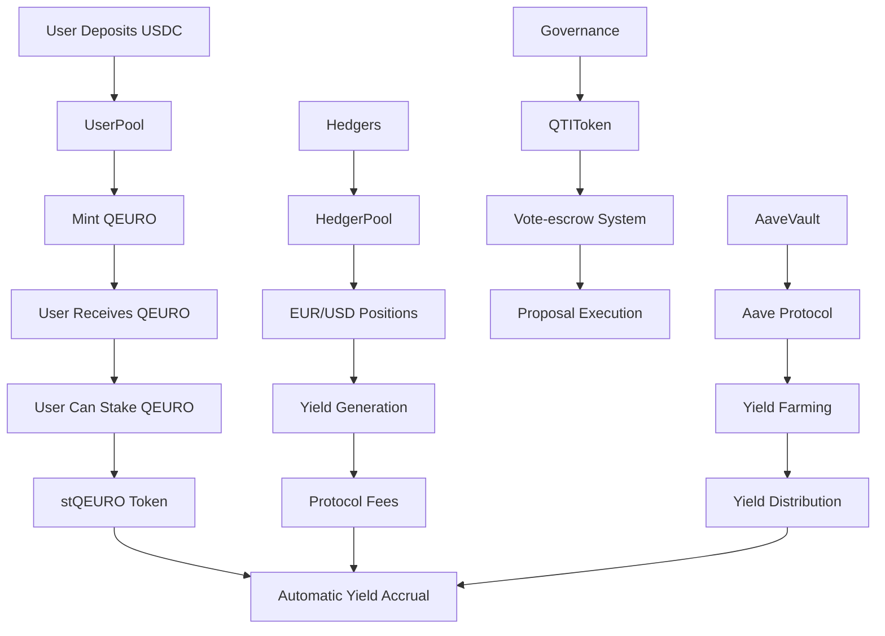

# Quantillon Protocol Smart Contracts

[](https://opensource.org/licenses/MIT)
[](https://soliditylang.org/)
[](https://getfoundry.sh/)
[](https://github.com/quantillon/smart-contracts)
[](https://github.com/quantillon/smart-contracts)

> **Euro-pegged stablecoin protocol with dual-pool architecture, yield generation, and governance mechanisms**

## 📖 Overview

Quantillon Protocol is a comprehensive DeFi ecosystem built around QEURO, a Euro-pegged stablecoin. The protocol features a dual-pool architecture that separates user deposits from hedging operations, enabling efficient yield generation while maintaining stability.

## 📚 Documentation

- **[API Documentation](docs/API.md)** - Complete API reference for all smart contracts
- **[Technical Reference](docs/API-Reference.md)** - Detailed technical specifications and implementation details
- **[Quick Start Guide](docs/Quick-Start.md)** - Get started quickly with integration examples
- **[Integration Examples](docs/Integration-Examples.md)** - Comprehensive integration examples and patterns
- **[Deployment Guide](scripts/deployment/README.md)** - Complete deployment instructions and procedures
- **[Documentation Hub](docs/README.md)** - Comprehensive documentation overview

### 🎯 Key Features

- **Euro-Pegged Stablecoin**: QEURO maintains 1:1 peg with Euro through sophisticated mechanisms
- **Dual-Pool Architecture**: Separates user deposits from hedging operations for optimal risk management
- **Yield Generation**: Multiple yield sources including protocol fees, interest differentials, and yield farming
- **Governance Token**: QTI token with vote-escrow mechanics for decentralized governance
- **Advanced Hedging**: EUR/USD hedging positions with margin management and liquidation systems
- **Yield-Bearing Wrapper**: stQEURO token that automatically accrues yield for holders
- **Aave Integration**: Automated yield farming through Aave protocol integration
- **Comprehensive Security**: Role-based access control, reentrancy protection, and emergency pause mechanisms

## 🏗️ Architecture

### Core Contracts

| Contract | Purpose | Key Features |
|----------|---------|--------------|
| **QEUROToken** | Euro-pegged stablecoin | Mint/burn controls, rate limiting, compliance features, 18 decimals |
| **QTIToken** | Governance token | Vote-escrow mechanics, fixed supply, lock periods, voting power multipliers |
| **QuantillonVault** | Main vault | Overcollateralized minting, liquidation system, fee management |
| **UserPool** | User deposits | Staking rewards, yield distribution, deposit/withdrawal management |
| **HedgerPool** | Hedging operations | EUR/USD positions, margin management, liquidation system |
| **stQEUROToken** | Yield-bearing wrapper | Automatic yield accrual, exchange rate mechanism |
| **AaveVault** | Aave integration | Automated yield farming, risk management, emergency controls |
| **YieldShift** | Yield management | Dynamic yield distribution, pool rebalancing, performance metrics |
| **ChainlinkOracle** | Price feeds | EUR/USD and USDC/USD price feeds with circuit breakers |

### Protocol Flow



## 🚀 Quick Start

### Prerequisites

- [Foundry](https://getfoundry.sh/) (latest version)
- Node.js 18+ (for additional tooling)
- Git

### Installation

```bash
# Clone the repository
git clone https://github.com/quantillon/smart-contracts.git
cd smart-contracts/quantillon-protocol

# Install dependencies
forge install

# Build contracts
forge build

# Run tests
forge test
```

### Environment Setup

Create a `.env` file in the project root:

```bash
# Network RPC URLs
ETHEREUM_RPC_URL=https://eth.llamarpc.com
BASE_RPC_URL=https://mainnet.base.org
BASE_SEPOLIA_RPC_URL=https://sepolia.base.org

# API Keys
BASESCAN_API_KEY=your_basescan_api_key
ETHERSCAN_API_KEY=your_etherscan_api_key

# Deployment
PRIVATE_KEY=your_private_key
```

## 🚀 Deployment

### Quick Start

Deploy the complete Quantillon Protocol to localhost:

```bash
# Start local blockchain
anvil --host 0.0.0.0 --port 8545 --accounts 10 --balance 10000

# Deploy all contracts
make deploy-full
```

### Multisig Deployment (Recommended for Production)

Deploy with multisig governance for enhanced security:

```bash
# Start local blockchain
anvil --host 0.0.0.0 --port 8545 --accounts 10 --balance 10000

# Set multisig wallet address
export MULTISIG_WALLET=0xYourMultisigWalletAddress

# Deploy with multisig configuration
make deploy-multisig

# Initialize contracts and transfer admin roles
make init-multisig

# Verify deployment
make verify-multisig
```

**Benefits of Multisig Deployment:**
- ✅ **Enhanced Security**: Multiple signatures required for critical operations
- ✅ **Decentralized Governance**: All protocol changes require multisig approval
- ✅ **Emergency Controls**: Multisig can pause or modify protocol parameters
- ✅ **Transparent Operations**: All changes are visible and require consensus

### Deployment Options

| Command | Description | Use Case |
|---------|-------------|----------|
| `make deploy-localhost` | Deploy to localhost (Anvil) | Development & testing |
| `make deploy-multisig` | Deploy with multisig configuration | Production with governance |
| `make init-multisig` | Initialize multisig deployment | Post-deployment setup |
| `make verify-multisig` | Verify multisig deployment | Post-deployment verification |
| `make deploy-sepolia` | Deploy to Sepolia testnet | Testnet validation |
| `make deploy-base` | Deploy to Base mainnet | Production deployment |
| `make deploy-partial` | Deploy contracts only | Custom initialization |
| `make deploy-full` | Full deployment + initialization | Complete setup |
| `make deploy-verify` | Verify deployed contracts | Post-deployment check |

### Manual Deployment

For custom deployment scenarios:

**Standard Deployment:**
```bash
# Deploy contracts
forge script scripts/deployment/DeployQuantillon.s.sol --rpc-url <RPC_URL> --broadcast

# Initialize contracts
forge script scripts/deployment/InitializeQuantillon.s.sol --rpc-url <RPC_URL> --broadcast

# Verify deployment
forge script scripts/deployment/VerifyDeployment.s.sol --rpc-url <RPC_URL>
```

**Multisig Deployment:**
```bash
# Set multisig wallet address
export MULTISIG_WALLET=0xYourMultisigWalletAddress

# Deploy contracts with multisig configuration
forge script scripts/deployment/DeployMultisig.s.sol --rpc-url <RPC_URL> --broadcast

# Set contract addresses and initialize
export TIME_PROVIDER=0x...
export CHAINLINK_ORACLE=0x...
# ... (set all contract addresses)

# Initialize contracts and transfer admin roles
forge script scripts/deployment/SimpleMultisigInit.s.sol --rpc-url <RPC_URL> --broadcast

# Verify multisig deployment
forge script scripts/deployment/VerifyMultisig.s.sol --rpc-url <RPC_URL>
```

### Network Configuration

Set environment variables for different networks:

```bash
# Sepolia testnet
export NETWORK=sepolia
export SEPOLIA_RPC_URL=https://sepolia.base.org
export EUR_USD_FEED_SEPOLIA=0x...
export USDC_USD_FEED_SEPOLIA=0x...
export USDC_TOKEN_SEPOLIA=0x...
export AAVE_POOL_SEPOLIA=0x...

# Base mainnet
export NETWORK=base
export BASE_RPC_URL=https://mainnet.base.org
export EUR_USD_FEED_BASE=0x...
export USDC_USD_FEED_BASE=0x...
export USDC_TOKEN_BASE=0x...
export AAVE_POOL_BASE=0x...
```

For detailed deployment instructions, see the [Deployment Guide](scripts/deployment/README.md).

For multisig deployment instructions, see the [Multisig Deployment Guide](MULTISIG_DEPLOYMENT.md).

## 📚 Documentation

### Generated Documentation

The protocol includes comprehensive NatSpec documentation for all contracts:

```bash
# Generate documentation
forge doc --build

# Serve documentation locally
forge doc --serve
```

Documentation will be available at `http://localhost:3000`

### Contract Documentation

- **[QEUROToken](./docs/src/src/core/QEUROToken.sol/contract.QEUROToken.md)**: Euro-pegged stablecoin implementation
- **[QTIToken](./docs/src/src/core/QTIToken.sol/contract.QTIToken.md)**: Governance token with vote-escrow
- **[QuantillonVault](./docs/src/src/core/QuantillonVault.sol/contract.QuantillonVault.md)**: Main vault for overcollateralized minting
- **[UserPool](./docs/src/src/core/UserPool.sol/contract.UserPool.md)**: User deposit and staking management
- **[HedgerPool](./docs/src/src/core/HedgerPool.sol/contract.HedgerPool.md)**: EUR/USD hedging operations
- **[stQEUROToken](./docs/src/src/core/stQEUROToken.sol/contract.stQEUROToken.md)**: Yield-bearing wrapper token
- **[AaveVault](./docs/src/src/core/vaults/AaveVault.sol/contract.AaveVault.md)**: Aave protocol integration
- **[YieldShift](./docs/src/src/core/yieldmanagement/YieldShift.sol/contract.YieldShift.md)**: Yield management and distribution

## 🧪 Testing

### Test Results

**Current Status**: 678 tests passed, 0 tests failed

- ✅ **Integration Tests**: 4/4 passed
- ✅ **QuantillonVault**: 55/55 passed
- ✅ **ChainlinkOracle**: 64/64 passed
- ✅ **UserPool**: 69/69 passed
- ✅ **VaultMath**: 14/14 passed
- ✅ **AaveVault**: 70/70 passed
- ✅ **stQEUROToken**: 62/62 passed
- ✅ **QEUROTokenBasic**: 3/3 passed
- ✅ **HedgerPool**: 65/65 passed
- ✅ **QEUROToken**: 83/83 passed
- ✅ **YieldShift**: 82/82 passed
- ✅ **TimeProvider**: 30/30 passed
- ✅ **QTIToken**: 78/78 passed
- ✅ **QuantillonInvariants**: 21/21 passed
- ✅ **Edge Case Tests**: 104/104 passed
  - OracleEdgeCases: 18/18 passed
  - LiquidationEdgeCases: 16/16 passed
  - EconomicAttackVectors: 15/15 passed
  - GasResourceEdgeCases: 15/15 passed
  - GovernanceAttackVectors: 15/15 passed
  - IntegrationEdgeCases: 3/3 passed
  - TimeBlockEdgeCases: 11/11 passed
  - YieldStakingEdgeCases: 11/11 passed

### Run All Tests

```bash
# Run all tests
forge test

# Run with verbose output
forge test -vvv

# Run specific test file
forge test --match-contract QEUROToken
```

### Test Coverage

```bash
# Generate coverage report
forge coverage

# Generate coverage report with lcov
forge coverage --report lcov
```

### Gas Optimization

```bash
# Generate gas report
forge test --gas-report

# Run comprehensive gas analysis
make gas-analysis

# Or run directly
./scripts/analyze-gas.sh
```

The gas analysis script provides detailed insights into:
- Contract size analysis
- State variable optimizations
- Function visibility recommendations
- Unused code detection
- Costly loop operations
- Storage layout analysis
- Function gas usage analysis

Reports are generated in a single human-readable text format.

## 🔧 Development

### Code Quality

```bash
# Format code
forge fmt

# Lint code
forge build --sizes

# Check for common issues
forge build --force
```

### Deployment

```bash
# Deploy to local network
forge script script/deploy/DeployProtocol.s.sol --rpc-url http://localhost:8545 --broadcast

# Deploy to testnet
forge script script/deploy/DeployProtocol.s.sol --rpc-url $BASE_SEPOLIA_RPC_URL --broadcast --verify

# Deploy to mainnet
forge script script/deploy/DeployProtocol.s.sol --rpc-url $BASE_RPC_URL --broadcast --verify
```

### Verification

```bash
# Verify contracts on Basescan
forge verify-contract <CONTRACT_ADDRESS> src/core/QEUROToken.sol:QEUROToken --chain-id 8453 --etherscan-api-key $BASESCAN_API_KEY
```

## 🛠️ Development Tools

The protocol includes several development and analysis tools in the `scripts/` directory:

### Gas Analysis

```bash
# Run comprehensive gas analysis
./scripts/analyze-gas.sh

# Or use the Makefile target
make gas-analysis
```

**Features:**
- Contract size analysis with size limit warnings
- State variable optimization recommendations
- Function visibility analysis (external vs public)
- Unused code detection
- Costly loop operation identification
- Storage layout analysis
- Function gas usage analysis
- Comprehensive optimization recommendations
- Uses Foundry for contract building and gas reporting
- Optional Slither integration for advanced analysis

**Output:**
- Single comprehensive report: `gas-analysis-YYYYMMDD_HHMMSS.txt`
- All analysis results in one human-readable text file

### NatSpec Validation

```bash
# Validate NatSpec documentation coverage
./scripts/validate-natspec.js

# Or use the Makefile target
make validate-natspec
```

**Features:**
- Scans all Solidity files for NatSpec documentation
- Identifies missing or incomplete documentation
- Provides detailed coverage reports
- Generates validation report: `natspec-validation-report.txt`

### Security Analysis

```bash
# Run Slither security analysis
./scripts/run-slither.sh

# Or use the Makefile target
make slither
```

**Features:**
- Comprehensive security vulnerability detection
- Gas optimization recommendations
- Code quality analysis
- Best practice enforcement

### Warning Analysis

```bash
# Analyze build warnings
./scripts/analyze-warnings.sh

# Or use the Makefile target
make analyze-warnings
```

**Features:**
- Categorizes warnings by type (unused variables, parameters, function mutability)
- Identifies files with the most warnings
- Provides actionable recommendations for fixing warnings
- Generates organized reports in `warnings-analysis/` directory
- Colorized output for better readability
- Integration with CI/CD pipeline

**Output Files:**
- `warnings-analysis/warnings-summary.log` - Complete analysis summary
- `warnings-analysis/warnings-unused-variables.log` - Unused variable warnings
- `warnings-analysis/warnings-unused-parameters.log` - Unused parameter warnings
- `warnings-analysis/warnings-function-mutability.log` - Function mutability warnings
- `warnings-analysis/warnings-solver.log` - Solver/CHC warnings

### Documentation Generation

```bash
# Generate contract documentation
./scripts/build-docs.sh

# Or use the Makefile target
make docs
```

**Features:**
- Generates comprehensive NatSpec documentation
- Creates searchable HTML documentation
- Includes all contract interfaces and implementations

### Benchmarking

```bash
# Benchmark specific functions or contracts
./scripts/benchmark-gas.sh <contract_name> <function_name>

# Example
./scripts/benchmark-gas.sh QEUROToken mint
```

**Features:**
- Targeted gas usage analysis
- Function-specific benchmarking
- Test-specific gas reporting

## 📊 Protocol Parameters

### QEURO Token
- **Decimals**: 18
- **Max Supply**: Configurable (default: 100,000,000 QEURO)
- **Rate Limit**: Configurable minting rate limits
- **Precision**: 1e18

### QTI Governance Token
- **Total Supply**: 100,000,000 QTI
- **Max Lock Time**: 4 years
- **Min Lock Time**: 7 days
- **Max Voting Power**: 4x multiplier
- **Week Duration**: 7 days

### Fee Structure
- **QEUROToken**: Rate limiting and compliance features
- **QuantillonVault**: Protocol fee and mint fee (configurable)
- **UserPool**: Deposit fee, withdrawal fee, performance fee (configurable)
- **HedgerPool**: Entry fee, exit fee, margin fee (configurable)
- **stQEUROToken**: Yield fee (configurable)

*Note: Specific fee percentages are configurable by governance and not hardcoded in contracts*

## 🔒 Security

### Security Features

- **Role-Based Access Control**: Granular permissions for all critical operations
- **Reentrancy Protection**: All external calls protected against reentrancy attacks
- **Emergency Pause**: Ability to pause operations in crisis situations
- **Rate Limiting**: Prevents abuse and provides time for emergency response
- **Oracle Validation**: Price feed validation and precision checks
- **Upgradeable Architecture**: UUPS pattern for future improvements

### Security Analysis Results

**Current Security Status**: ✅ **No Critical or Medium Priority Issues**

- **🔴 High Priority Issues**: 0
- **🟡 Medium Priority Issues**: 0
- **🟢 Low Priority Issues**: 2 (calls-loop)
- **ℹ️ Informational Issues**: 1 (low-level-calls)

**Mythril Analysis Results**: ✅ **No Vulnerabilities Detected**
- **Total Contracts Analyzed**: 10
- **Contracts with Issues**: 0
- **Total Issues Found**: 0
- **Security Status**: Clean - No vulnerabilities detected by symbolic execution

**Security Tools Used:**
- Slither static analysis
- Mythril symbolic execution analysis
- Comprehensive test coverage (678 tests)
- Invariant testing (21 invariants)
- Edge case testing (104 edge case tests)
- Gas optimization analysis
- Warning analysis and resolution

### Security Contact

For security issues, please contact: `team@quantillon.money`

### Security Analysis

```bash
# Run Slither security analysis
make slither

# Run Mythril symbolic execution analysis
make mythril

# Or run directly
./scripts/run-slither.sh
./scripts/run-mythril.sh

# Run comprehensive gas analysis (includes security insights)
make gas-analysis
```

## 🤝 Contributing

### Development Workflow

1. Fork the repository
2. Create a feature branch (`git checkout -b feature/amazing-feature`)
3. Commit your changes (`git commit -m 'Add amazing feature'`)
4. Push to the branch (`git push origin feature/amazing-feature`)
5. Open a Pull Request

### Code Standards

- Follow Solidity style guide
- Add comprehensive tests for new features
- Update documentation for any changes
- Ensure all tests pass before submitting PR
- Run security analysis before submitting PR

## 🚀 Quick Reference

### Common Commands

```bash
# Development
make build          # Build contracts
make test           # Run all tests
make coverage       # Generate test coverage
make docs           # Generate documentation

# Analysis
make gas-analysis   # Comprehensive gas analysis
make validate-natspec  # Validate NatSpec documentation
make slither        # Security analysis
make mythril        # Mythril symbolic execution analysis
make analyze-warnings  # Analyze build warnings

# Quality Assurance
make lint           # Code linting
make format         # Code formatting
make all            # Run all checks (build, test, coverage, docs, validation)
```

### Analysis Results

All analysis output files are organized in the `results/` directory (configurable via `RESULTS_DIR` environment variable):

- **`results/gas-analysis/`** - Gas optimization reports
- **`results/mythril-reports/`** - Mythril security analysis
- **`results/warnings-analysis/`** - Build warnings analysis
- **`results/slither/`** - Slither security analysis
- **`results/natspec-validation-report.txt`** - NatSpec documentation validation

**Custom Output Directory:**
```bash
RESULTS_DIR=analysis-output make gas-analysis  # Use custom directory
RESULTS_DIR=/tmp/reports make slither          # Use absolute path
```

### Current Status

- **Build**: ✅ Successful
- **Tests**: ✅ 678 passed, 0 failed
- **Security**: ✅ No critical issues (Slither + Mythril clean)
- **Documentation**: ✅ Comprehensive NatSpec coverage (1872/1872 functions documented)
- **Gas Optimization**: ✅ Analyzed and optimized
- **Warning Analysis**: ✅ 7 unused variable warnings (acceptable)

## 🌐 Links

- **Website**: [quantillon.money](https://quantillon.money)
- **Documentation**: [docs.quantillon.money](https://docs.quantillon.money)
- **X (Twitter)**: [@QuantillonLabs](https://x.com/QuantillonLabs)
- **Discord**: [discord.gg/uk8T9GqdE5](https://discord.gg/uk8T9GqdE5)
- **Telegram**: [@QuantillonLabs](https://t.me/QuantillonLabs)

## 🙏 Acknowledgments

- OpenZeppelin for secure contract libraries
- Chainlink for reliable price feeds
- Foundry team for excellent development tools
- The broader DeFi community for inspiration and feedback

---

**Built with ❤️ by the Quantillon Labs team**

**Author**: Quantillon Labs - Nicolas Bellengé - @chewbaccoin