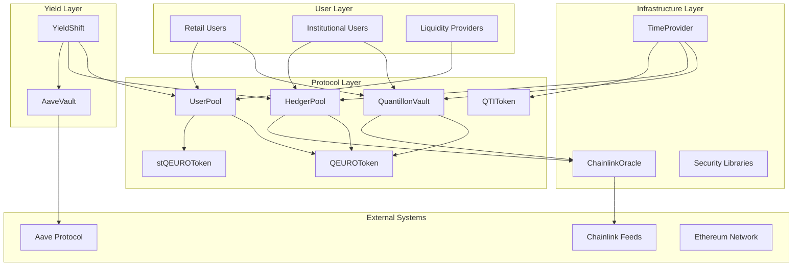
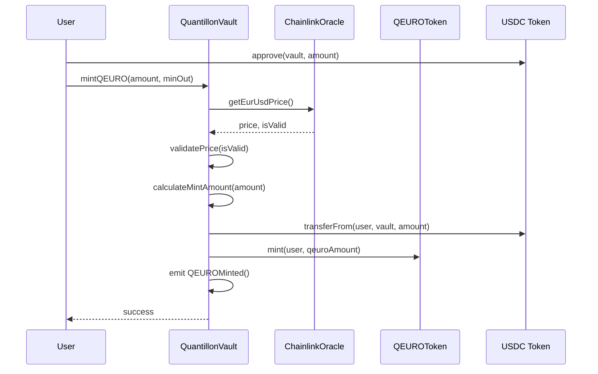
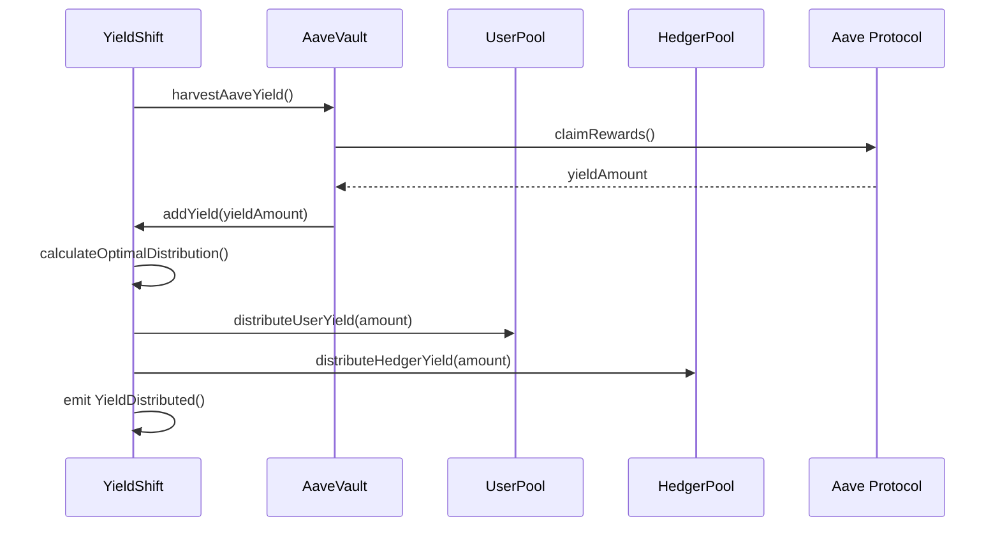
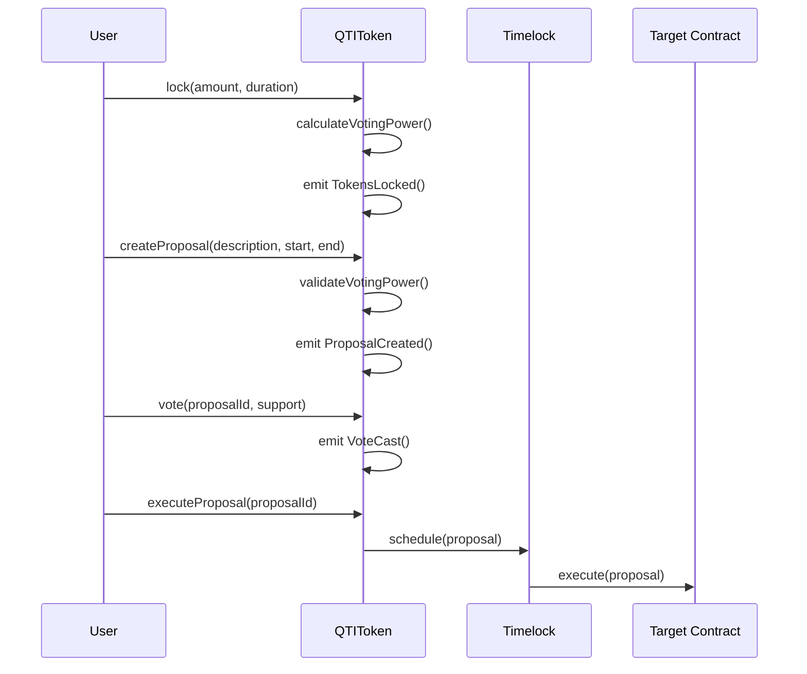

# Quantillon Protocol Architecture

## Overview

The Quantillon Protocol is a sophisticated DeFi ecosystem built around a euro-pegged stablecoin (QEURO) with advanced yield management and risk mitigation systems. The architecture is designed for scalability, security, and efficient capital utilization.

---

## System Architecture

### High-Level Architecture

---

## Core Components

### 1. QuantillonVault

**Purpose**: Central vault managing QEURO minting and redemption against USDC collateral.

**Key Responsibilities**:
- Overcollateralized QEURO minting
- USDC collateral management
- Oracle price validation
- Liquidation system
- Fee collection and distribution

**Architecture Patterns**:
- **Proxy Pattern**: Upgradeable implementation
- **Access Control**: Role-based permissions
- **Reentrancy Protection**: Secure external calls
- **Circuit Breaker**: Emergency pause mechanisms

### 2. QEUROToken

**Purpose**: Euro-pegged stablecoin with compliance and governance features.

**Key Features**:
- ERC-20 compliant with extensions
- Mint/burn controls via vault
- Compliance features (whitelist/blacklist)
- Rate limiting mechanisms
- Supply cap management

**Architecture Patterns**:
- **Factory Pattern**: Controlled token creation
- **Observer Pattern**: Event-driven compliance
- **State Machine**: Pause/unpause states

### 3. QTIToken

**Purpose**: Governance token with vote-escrow mechanics for protocol governance.

**Key Features**:
- Vote-escrow token mechanics
- Time-weighted voting power
- Governance proposal system
- Delegation capabilities
- Lock period management

**Architecture Patterns**:
- **Escrow Pattern**: Time-locked voting power
- **Voting System**: Proposal and execution framework
- **Decay Function**: Linear voting power decay

### 4. UserPool

**Purpose**: Manages user deposits, staking, and yield distribution.

**Key Features**:
- USDC deposit/withdrawal
- QEURO staking for rewards
- Yield distribution system
- User position tracking
- Reward calculation and claiming

**Architecture Patterns**:
- **Pool Pattern**: Centralized liquidity management
- **Reward Distribution**: Proportional yield allocation
- **State Tracking**: User position management

### 5. HedgerPool

**Purpose**: Manages leveraged hedging positions for risk management.

**Key Features**:
- EUR/USD hedging positions
- Margin management system
- Liquidation mechanisms
- Position tracking and PnL calculation
- Risk parameter management

**Architecture Patterns**:
- **Position Management**: Individual position tracking
- **Margin System**: Collateral and leverage management
- **Liquidation Engine**: Automated risk management
- **Oracle Integration**: Price feed validation

### 6. stQEUROToken

**Purpose**: Yield-bearing wrapper for QEURO with automatic yield accrual.

**Key Features**:
- Automatic yield distribution
- Exchange rate mechanism
- Virtual protection against donation attacks
- Yield claiming system
- Treasury management

**Architecture Patterns**:
- **Wrapper Pattern**: Enhanced token functionality
- **Yield Distribution**: Proportional yield allocation
- **Virtual Protection**: Attack prevention mechanisms

---

## Yield Management Architecture

### YieldShift System

**Purpose**: Intelligent yield distribution between user and hedger pools.

**Components**:
- **Yield Sources**: Aave, protocol fees, interest differentials
- **Distribution Engine**: Dynamic allocation between pools
- **Performance Metrics**: Yield tracking and optimization
- **Rebalancing Logic**: Automatic pool rebalancing

**Architecture Patterns**:
- **Strategy Pattern**: Multiple yield source strategies
- **Observer Pattern**: Performance monitoring
- **Factory Pattern**: Dynamic strategy creation

### AaveVault Integration

**Purpose**: Automated yield generation through Aave protocol.

**Features**:
- USDC deployment to Aave
- Yield harvesting and distribution
- Risk management and exposure limits
- Emergency withdrawal mechanisms
- Auto-rebalancing based on market conditions

**Architecture Patterns**:
- **Adapter Pattern**: Aave protocol integration
- **Risk Management**: Exposure limit enforcement
- **Yield Optimization**: Dynamic allocation strategies

---

## Security Architecture

### Access Control System

**Role-Based Access Control (RBAC)**:
- `DEFAULT_ADMIN_ROLE`: Super admin privileges
- `EMERGENCY_ROLE`: Emergency operations
- `GOVERNANCE_ROLE`: Protocol governance
- `VAULT_ROLE`: Vault operations
- `YIELD_MANAGER_ROLE`: Yield management
- `COMPLIANCE_ROLE`: Compliance operations
- `LIQUIDATOR_ROLE`: Liquidation operations
- `TIME_MANAGER_ROLE`: Time management

### Security Patterns

**Reentrancy Protection**:
- `nonReentrant` modifier on all state-changing functions
- Checks-effects-interactions pattern
- External call isolation

**Oracle Security**:
- Multiple price feed validation
- Staleness checks
- Circuit breaker mechanisms
- Price bound validation

**Emergency Systems**:
- Pause/unpause mechanisms
- Emergency withdrawal functions
- Circuit breaker activation
- Recovery procedures

---

## Data Flow Architecture

### QEURO Minting Flow

### Yield Distribution Flow

### Governance Flow

---

## Scalability Architecture

### Gas Optimization

**Storage Optimization**:
- Packed structs for efficient storage
- Batch operations for multiple updates
- Event-based logging instead of storage
- Minimal state variables

**Computation Optimization**:
- Cached values for repeated calculations
- Efficient algorithms for complex operations
- Minimal external calls
- Optimized loops and iterations

### Upgradeability

**Proxy Pattern Implementation**:
- Transparent proxy for admin functions
- UUPS proxy for gas efficiency
- Storage layout compatibility
- Initialization pattern for upgrades

**Upgrade Process**:
1. Deploy new implementation
2. Validate compatibility
3. Schedule upgrade via governance
4. Execute upgrade after timelock
5. Verify functionality

---

## Integration Architecture

### External Integrations

**Chainlink Oracle**:
- EUR/USD price feed
- USDC/USD price feed
- Staleness validation
- Circuit breaker integration

**Aave Protocol**:
- USDC lending integration
- Yield harvesting
- Risk management
- Emergency withdrawal

**ERC-20 Standards**:
- Full ERC-20 compliance
- Extended functionality
- Metadata support
- Permit functionality

### API Architecture

**Contract Interfaces**:
- Standardized function signatures
- Consistent error handling
- Event emission patterns
- Access control integration

**Integration Patterns**:
- Factory pattern for contract creation
- Registry pattern for contract discovery
- Proxy pattern for upgrades
- Adapter pattern for external integrations

---

## Monitoring and Observability

### Event Architecture

**Core Events**:
- Token transfers and approvals
- Vault operations (mint/redeem)
- Staking and unstaking
- Yield distribution
- Governance actions

**Monitoring Events**:
- System health indicators
- Performance metrics
- Error conditions
- Security events

### Analytics Architecture

**On-Chain Analytics**:
- Transaction volume tracking
- Yield performance metrics
- User behavior analysis
- Risk metrics monitoring

**Off-Chain Analytics**:
- Protocol health dashboards
- Performance reporting
- Risk assessment
- Compliance monitoring

---

## Future Architecture Considerations

### Layer 2 Integration

**Planned Support**:
- Polygon deployment
- Arbitrum integration
- Optimism support
- Base network expansion

**Cross-Chain Architecture**:
- Bridge integration
- Cross-chain governance
- Unified yield management
- Shared security model

### Advanced Features

**Planned Enhancements**:
- Advanced yield strategies
- Institutional features
- MEV protection
- Enhanced governance
- Automated market making

---

## Architecture Principles

### Design Principles

1. **Security First**: All components designed with security as the primary concern
2. **Modularity**: Clear separation of concerns and modular design
3. **Upgradeability**: Future-proof design with upgrade capabilities
4. **Gas Efficiency**: Optimized for cost-effective operations
5. **Transparency**: Open and auditable code and processes

### Development Principles

1. **Test-Driven Development**: Comprehensive test coverage
2. **Documentation**: Complete documentation for all components
3. **Code Review**: Rigorous review process for all changes
4. **Continuous Integration**: Automated testing and deployment
5. **Security Audits**: Regular security assessments

---

*This architecture document is maintained by Quantillon Labs and updated with each protocol version.*
