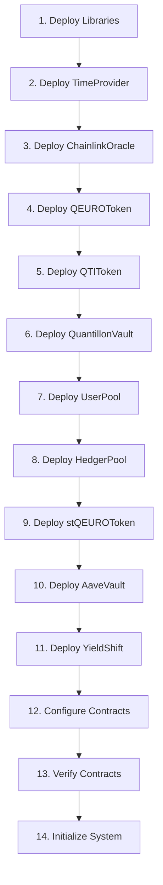

# Quantillon Protocol Deployment Guide

## Overview

This guide provides step-by-step instructions for deploying and configuring the Quantillon Protocol smart contracts. It covers both testnet and mainnet deployments, including verification, initialization, and post-deployment configuration.

---

## Prerequisites

### Development Environment

**Required Tools**:
- Node.js 16+ and npm/yarn
- Foundry (forge, cast, anvil)
- Git
- MetaMask or compatible wallet

**Installation**:
```bash
# Install Foundry
curl -L https://foundry.paradigm.xyz | bash
foundryup

# Install Node.js dependencies
npm install
```

### Network Configuration

**Testnet RPC URLs**:
- Goerli: `https://goerli.infura.io/v3/YOUR_PROJECT_ID`
- Sepolia: `https://sepolia.infura.io/v3/YOUR_PROJECT_ID`
- Base Goerli: `https://goerli.base.org`

**Mainnet RPC URLs**:
- Ethereum: `https://mainnet.infura.io/v3/YOUR_PROJECT_ID`
- Base: `https://mainnet.base.org`

---

## Deployment Architecture

### Deployment Order



### Contract Dependencies

| Contract | Dependencies |
|----------|-------------|
| TimeProvider | None |
| ChainlinkOracle | TimeProvider |
| QEUROToken | None |
| QTIToken | TimeProvider |
| QuantillonVault | QEUROToken, ChainlinkOracle |
| UserPool | QEUROToken, QuantillonVault |
| HedgerPool | QEUROToken, ChainlinkOracle |
| stQEUROToken | QEUROToken |
| AaveVault | QEUROToken, ChainlinkOracle |
| YieldShift | UserPool, HedgerPool, AaveVault |

---

## Deployment Scripts

### 1. Environment Setup

**Create `.env` file**:
```bash
# Network Configuration
RPC_URL_MAINNET=https://mainnet.infura.io/v3/YOUR_PROJECT_ID
RPC_URL_GOERLI=https://goerli.infura.io/v3/YOUR_PROJECT_ID
RPC_URL_BASE=https://mainnet.base.org

# Private Keys (use environment variables in production)
PRIVATE_KEY=0x...
ADMIN_ADDRESS=0x...
TREASURY_ADDRESS=0x...

# Oracle Configuration
EUR_USD_FEED=0x...
USDC_USD_FEED=0x...

# Aave Configuration
AAVE_POOL_ADDRESS=0x...
USDC_TOKEN_ADDRESS=0x...

# Gas Configuration
GAS_PRICE=20000000000  # 20 gwei
GAS_LIMIT=8000000
```

### 2. Deployment Script

**Create `scripts/deploy.js`**:
```javascript
const { ethers } = require("hardhat");

async function main() {
    console.log("🚀 Starting Quantillon Protocol deployment...");
    
    // Get deployer account
    const [deployer] = await ethers.getSigners();
    console.log("Deploying contracts with account:", deployer.address);
    console.log("Account balance:", ethers.utils.formatEther(await deployer.getBalance()));
    
    // Deployment parameters
    const adminAddress = process.env.ADMIN_ADDRESS || deployer.address;
    const treasuryAddress = process.env.TREASURY_ADDRESS || deployer.address;
    
    // 1. Deploy TimeProvider
    console.log("\n📅 Deploying TimeProvider...");
    const TimeProvider = await ethers.getContractFactory("TimeProvider");
    const timeProvider = await TimeProvider.deploy();
    await timeProvider.deployed();
    console.log("TimeProvider deployed to:", timeProvider.address);
    
    // 2. Deploy ChainlinkOracle
    console.log("\n🔗 Deploying ChainlinkOracle...");
    const ChainlinkOracle = await ethers.getContractFactory("ChainlinkOracle");
    const chainlinkOracle = await ChainlinkOracle.deploy(
        process.env.EUR_USD_FEED,
        process.env.USDC_USD_FEED,
        timeProvider.address
    );
    await chainlinkOracle.deployed();
    console.log("ChainlinkOracle deployed to:", chainlinkOracle.address);
    
    // 3. Deploy QEUROToken
    console.log("\n💰 Deploying QEUROToken...");
    const QEUROToken = await ethers.getContractFactory("QEUROToken");
    const qeuroToken = await QEUROToken.deploy();
    await qeuroToken.deployed();
    console.log("QEUROToken deployed to:", qeuroToken.address);
    
    // 4. Deploy QTIToken
    console.log("\n🗳️ Deploying QTIToken...");
    const QTIToken = await ethers.getContractFactory("QTIToken");
    const qtiToken = await QTIToken.deploy();
    await qtiToken.deployed();
    console.log("QTIToken deployed to:", qtiToken.address);
    
    // 5. Deploy QuantillonVault
    console.log("\n🏦 Deploying QuantillonVault...");
    const QuantillonVault = await ethers.getContractFactory("QuantillonVault");
    const quantillonVault = await QuantillonVault.deploy();
    await quantillonVault.deployed();
    console.log("QuantillonVault deployed to:", quantillonVault.address);
    
    // 6. Deploy UserPool
    console.log("\n👥 Deploying UserPool...");
    const UserPool = await ethers.getContractFactory("UserPool");
    const userPool = await UserPool.deploy();
    await userPool.deployed();
    console.log("UserPool deployed to:", userPool.address);
    
    // 7. Deploy HedgerPool
    console.log("\n⚖️ Deploying HedgerPool...");
    const HedgerPool = await ethers.getContractFactory("HedgerPool");
    const hedgerPool = await HedgerPool.deploy();
    await hedgerPool.deployed();
    console.log("HedgerPool deployed to:", hedgerPool.address);
    
    // 8. Deploy stQEUROToken
    console.log("\n📈 Deploying stQEUROToken...");
    const stQEUROToken = await ethers.getContractFactory("stQEUROToken");
    const stQeuroToken = await stQEUROToken.deploy();
    await stQeuroToken.deployed();
    console.log("stQEUROToken deployed to:", stQeuroToken.address);
    
    // 9. Deploy AaveVault
    console.log("\n🏛️ Deploying AaveVault...");
    const AaveVault = await ethers.getContractFactory("AaveVault");
    const aaveVault = await AaveVault.deploy();
    await aaveVault.deployed();
    console.log("AaveVault deployed to:", aaveVault.address);
    
    // 10. Deploy YieldShift
    console.log("\n🔄 Deploying YieldShift...");
    const YieldShift = await ethers.getContractFactory("YieldShift");
    const yieldShift = await YieldShift.deploy();
    await yieldShift.deployed();
    console.log("YieldShift deployed to:", yieldShift.address);
    
    // Save deployment addresses
    const deploymentInfo = {
        network: network.name,
        timestamp: new Date().toISOString(),
        deployer: deployer.address,
        contracts: {
            TimeProvider: timeProvider.address,
            ChainlinkOracle: chainlinkOracle.address,
            QEUROToken: qeuroToken.address,
            QTIToken: qtiToken.address,
            QuantillonVault: quantillonVault.address,
            UserPool: userPool.address,
            HedgerPool: hedgerPool.address,
            stQEUROToken: stQeuroToken.address,
            AaveVault: aaveVault.address,
            YieldShift: yieldShift.address
        }
    };
    
    // Write deployment info to file
    const fs = require('fs');
    fs.writeFileSync(
        `deployments/${network.name}-${Date.now()}.json`,
        JSON.stringify(deploymentInfo, null, 2)
    );
    
    console.log("\n✅ Deployment completed successfully!");
    console.log("Deployment info saved to deployments/ directory");
    
    return deploymentInfo;
}

main()
    .then(() => process.exit(0))
    .catch((error) => {
        console.error("❌ Deployment failed:", error);
        process.exit(1);
    });
```

### 3. Configuration Script

**Create `scripts/configure.js`**:
```javascript
const { ethers } = require("hardhat");

async function main() {
    console.log("⚙️ Configuring Quantillon Protocol...");
    
    // Load deployment info
    const deploymentInfo = require("../deployments/latest.json");
    const contracts = deploymentInfo.contracts;
    
    const [deployer] = await ethers.getSigners();
    
    // Get contract instances
    const timeProvider = await ethers.getContractAt("TimeProvider", contracts.TimeProvider);
    const chainlinkOracle = await ethers.getContractAt("ChainlinkOracle", contracts.ChainlinkOracle);
    const qeuroToken = await ethers.getContractAt("QEUROToken", contracts.QEUROToken);
    const qtiToken = await ethers.getContractAt("QTIToken", contracts.QTIToken);
    const quantillonVault = await ethers.getContractAt("QuantillonVault", contracts.QuantillonVault);
    const userPool = await ethers.getContractAt("UserPool", contracts.UserPool);
    const hedgerPool = await ethers.getContractAt("HedgerPool", contracts.HedgerPool);
    const stQeuroToken = await ethers.getContractAt("stQEUROToken", contracts.stQEUROToken);
    const aaveVault = await ethers.getContractAt("AaveVault", contracts.AaveVault);
    const yieldShift = await ethers.getContractAt("YieldShift", contracts.YieldShift);
    
    // 1. Initialize TimeProvider
    console.log("\n📅 Initializing TimeProvider...");
    await timeProvider.initialize(deployer.address);
    console.log("✅ TimeProvider initialized");
    
    // 2. Initialize ChainlinkOracle
    console.log("\n🔗 Initializing ChainlinkOracle...");
    await chainlinkOracle.initialize(
        deployer.address,
        process.env.EUR_USD_FEED,
        process.env.USDC_USD_FEED
    );
    console.log("✅ ChainlinkOracle initialized");
    
    // 3. Initialize QEUROToken
    console.log("\n💰 Initializing QEUROToken...");
    await qeuroToken.initialize(
        deployer.address,
        process.env.TREASURY_ADDRESS || deployer.address
    );
    console.log("✅ QEUROToken initialized");
    
    // 4. Initialize QTIToken
    console.log("\n🗳️ Initializing QTIToken...");
    await qtiToken.initialize(
        deployer.address,
        process.env.TREASURY_ADDRESS || deployer.address,
        deployer.address // Timelock address (can be updated later)
    );
    console.log("✅ QTIToken initialized");
    
    // 5. Initialize QuantillonVault
    console.log("\n🏦 Initializing QuantillonVault...");
    await quantillonVault.initialize(
        deployer.address,
        contracts.QEUROToken,
        process.env.USDC_TOKEN_ADDRESS,
        contracts.ChainlinkOracle
    );
    console.log("✅ QuantillonVault initialized");
    
    // 6. Initialize UserPool
    console.log("\n👥 Initializing UserPool...");
    await userPool.initialize(
        deployer.address,
        contracts.QEUROToken,
        contracts.QuantillonVault,
        process.env.USDC_TOKEN_ADDRESS
    );
    console.log("✅ UserPool initialized");
    
    // 7. Initialize HedgerPool
    console.log("\n⚖️ Initializing HedgerPool...");
    await hedgerPool.initialize(
        deployer.address,
        contracts.QEUROToken,
        contracts.ChainlinkOracle,
        process.env.USDC_TOKEN_ADDRESS
    );
    console.log("✅ HedgerPool initialized");
    
    // 8. Initialize stQEUROToken
    console.log("\n📈 Initializing stQEUROToken...");
    await stQeuroToken.initialize(
        deployer.address,
        contracts.QEUROToken,
        process.env.TREASURY_ADDRESS || deployer.address
    );
    console.log("✅ stQEUROToken initialized");
    
    // 9. Initialize AaveVault
    console.log("\n🏛️ Initializing AaveVault...");
    await aaveVault.initialize(
        deployer.address,
        contracts.QEUROToken,
        process.env.USDC_TOKEN_ADDRESS,
        process.env.AAVE_POOL_ADDRESS
    );
    console.log("✅ AaveVault initialized");
    
    // 10. Initialize YieldShift
    console.log("\n🔄 Initializing YieldShift...");
    await yieldShift.initialize(
        deployer.address,
        contracts.UserPool,
        contracts.HedgerPool,
        contracts.AaveVault,
        process.env.USDC_TOKEN_ADDRESS
    );
    console.log("✅ YieldShift initialized");
    
    // 11. Configure contract relationships
    console.log("\n🔗 Configuring contract relationships...");
    
    // Set vault role for QEURO token
    const VAULT_ROLE = await qeuroToken.VAULT_ROLE();
    await qeuroToken.grantRole(VAULT_ROLE, contracts.QuantillonVault);
    console.log("✅ Vault role granted to QuantillonVault");
    
    // Set yield manager roles
    const YIELD_MANAGER_ROLE = await yieldShift.YIELD_MANAGER_ROLE();
    await yieldShift.grantRole(YIELD_MANAGER_ROLE, contracts.AaveVault);
    console.log("✅ Yield manager role granted to AaveVault");
    
    // Set authorized yield sources
    await yieldShift.setAuthorizedYieldSource(contracts.AaveVault, true);
    console.log("✅ AaveVault authorized as yield source");
    
    console.log("\n✅ Configuration completed successfully!");
}

main()
    .then(() => process.exit(0))
    .catch((error) => {
        console.error("❌ Configuration failed:", error);
        process.exit(1);
    });
```

---

## Network-Specific Deployment

### Testnet Deployment

**Goerli Testnet**:
```bash
# Set network
export NETWORK=goerli

# Deploy contracts
npx hardhat run scripts/deploy.js --network goerli

# Configure contracts
npx hardhat run scripts/configure.js --network goerli

# Verify contracts
npx hardhat verify --network goerli
```

**Sepolia Testnet**:
```bash
# Set network
export NETWORK=sepolia

# Deploy contracts
npx hardhat run scripts/deploy.js --network sepolia

# Configure contracts
npx hardhat run scripts/configure.js --network sepolia

# Verify contracts
npx hardhat verify --network sepolia
```

### Mainnet Deployment

**Ethereum Mainnet**:
```bash
# Set network
export NETWORK=mainnet

# Deploy contracts
npx hardhat run scripts/deploy.js --network mainnet

# Configure contracts
npx hardhat run scripts/configure.js --network mainnet

# Verify contracts
npx hardhat verify --network mainnet
```

**Base Mainnet**:
```bash
# Set network
export NETWORK=base

# Deploy contracts
npx hardhat run scripts/deploy.js --network base

# Configure contracts
npx hardhat run scripts/configure.js --network base

# Verify contracts
npx hardhat verify --network base
```

---

## Contract Verification

### Etherscan Verification

**Automatic Verification**:
```bash
# Verify all contracts
npx hardhat verify --network mainnet

# Verify specific contract
npx hardhat verify --network mainnet CONTRACT_ADDRESS "constructor_arg1" "constructor_arg2"
```

**Manual Verification**:
1. Go to [Etherscan](https://etherscan.io/)
2. Navigate to contract address
3. Click "Contract" tab
4. Click "Verify and Publish"
5. Fill in contract details
6. Upload source code
7. Submit for verification

### Sourcify Verification

```bash
# Install Sourcify CLI
npm install -g @sourcify/cli

# Verify contracts
sourcify verify --chain-id 1 --endpoint https://sourcify.dev/server CONTRACT_ADDRESS
```

---

## Post-Deployment Configuration

### 1. Governance Setup

**Create Timelock**:
```javascript
// Deploy Timelock contract
const Timelock = await ethers.getContractFactory("TimelockUpgradeable");
const timelock = await Timelock.deploy(
    deployer.address, // admin
    2 * 24 * 60 * 60, // delay (2 days)
    [deployer.address], // proposers
    [deployer.address]  // executors
);
await timelock.deployed();

// Transfer admin role to timelock
await qtiToken.grantRole(await qtiToken.DEFAULT_ADMIN_ROLE(), timelock.address);
await qtiToken.renounceRole(await qtiToken.DEFAULT_ADMIN_ROLE(), deployer.address);
```

**Setup Governance**:
```javascript
// Create initial proposal
const proposalDescription = "Initial protocol configuration";
const startTime = Math.floor(Date.now() / 1000) + 24 * 60 * 60; // 1 day
const endTime = startTime + 7 * 24 * 60 * 60; // 7 days

const proposalId = await qtiToken.createProposal(
    proposalDescription,
    startTime,
    endTime
);
```

### 2. Oracle Configuration

**Update Price Feeds**:
```javascript
// Update EUR/USD feed
await chainlinkOracle.updatePriceFeeds(
    "0x...", // EUR/USD feed
    "0x..."  // USDC/USD feed
);

// Set price bounds
await chainlinkOracle.updatePriceBounds(
    ethers.utils.parseUnits("0.8", 8), // min price
    ethers.utils.parseUnits("1.2", 8)  // max price
);
```

### 3. Risk Parameters

**Set Vault Parameters**:
```javascript
// Set collateralization ratio
await quantillonVault.setCollateralizationRatio(11000); // 110%

// Set liquidation threshold
await quantillonVault.setLiquidationThreshold(10500); // 105%

// Set protocol fees
await quantillonVault.setProtocolFee(100); // 1%
```

**Set HedgerPool Parameters**:
```javascript
// Set maximum leverage
await hedgerPool.setMaxLeverage(10);

// Set margin requirements
await hedgerPool.setMinMarginRatio(11000); // 110%

// Set liquidation penalty
await hedgerPool.setLiquidationPenalty(200); // 2%
```

### 4. Yield Configuration

**Configure YieldShift**:
```javascript
// Set target pool ratio
await yieldShift.setTargetPoolRatio(6000); // 60% user, 40% hedger

// Set rebalancing threshold
await yieldShift.setRebalanceThreshold(500); // 5%

// Set yield distribution parameters
await yieldShift.setYieldShiftParameters(
    1000, // 10% max shift
    100,  // 1% min shift
    86400 // 1 day shift period
);
```

---

## Monitoring and Maintenance

### 1. Health Checks

**Create monitoring script**:
```javascript
async function healthCheck() {
    const contracts = require("./deployments/latest.json").contracts;
    
    // Check contract states
    const vault = await ethers.getContractAt("QuantillonVault", contracts.QuantillonVault);
    const oracle = await ethers.getContractAt("ChainlinkOracle", contracts.ChainlinkOracle);
    
    const isPaused = await vault.paused();
    const [price, isValid] = await oracle.getEurUsdPrice();
    const metrics = await vault.getVaultMetrics();
    
    console.log("Health Check Results:");
    console.log(`Vault Paused: ${isPaused}`);
    console.log(`Oracle Price Valid: ${isValid}`);
    console.log(`Collateralization Ratio: ${metrics.collateralizationRatio / 100}%`);
    
    if (isPaused || !isValid || metrics.collateralizationRatio < 11000) {
        console.warn("⚠️ Health check failed!");
    } else {
        console.log("✅ All systems healthy");
    }
}
```

### 2. Automated Monitoring

**Set up alerts**:
```javascript
// Price deviation alert
if (priceDeviation > 0.05) {
    await sendAlert("Price deviation > 5%");
}

// Liquidity alert
if (liquidityRatio < 1.1) {
    await sendAlert("Low liquidity ratio");
}

// Oracle staleness alert
if (!isValid) {
    await sendAlert("Oracle price is stale");
}
```

### 3. Regular Maintenance

**Weekly Tasks**:
- Check contract health
- Review oracle prices
- Monitor yield performance
- Update risk parameters if needed

**Monthly Tasks**:
- Review governance proposals
- Update documentation
- Security audit review
- Performance optimization

---

## Troubleshooting

### Common Issues

**1. Deployment Fails**:
```bash
# Check gas limit
export GAS_LIMIT=10000000

# Check network connection
npx hardhat console --network mainnet

# Check account balance
cast balance $DEPLOYER_ADDRESS --rpc-url $RPC_URL
```

**2. Verification Fails**:
```bash
# Check constructor arguments
npx hardhat verify --network mainnet CONTRACT_ADDRESS "arg1" "arg2"

# Use flatten for complex contracts
npx hardhat flatten contracts/Contract.sol > flattened.sol
```

**3. Initialization Fails**:
```bash
# Check contract addresses
cast code CONTRACT_ADDRESS --rpc-url $RPC_URL

# Check if already initialized
cast call CONTRACT_ADDRESS "initialized()" --rpc-url $RPC_URL
```

### Recovery Procedures

**1. Failed Deployment**:
- Check transaction logs
- Verify network status
- Retry with higher gas limit
- Use different RPC endpoint

**2. Failed Configuration**:
- Check contract dependencies
- Verify role assignments
- Retry individual steps
- Use emergency procedures if needed

**3. Emergency Recovery**:
- Activate emergency pause
- Notify stakeholders
- Assess damage
- Implement fixes
- Resume operations

---

## Security Considerations

### Deployment Security

**Private Key Management**:
- Use hardware wallets for mainnet
- Store keys in secure environments
- Use multi-signature wallets
- Implement key rotation

**Network Security**:
- Use trusted RPC endpoints
- Verify network connections
- Monitor for attacks
- Implement rate limiting

### Post-Deployment Security

**Access Control**:
- Transfer admin roles to timelock
- Implement multi-signature requirements
- Regular role audits
- Emergency procedures

**Monitoring**:
- Real-time monitoring
- Automated alerts
- Incident response
- Regular security reviews

---

## Support

### Deployment Support

**Technical Support**:
- Email: team@quantillon.money
- Discord: [Quantillon Discord](https://discord.gg/uk8T9GqdE5)
- GitHub: [Issues](https://github.com/Quantillon-Labs/smart-contracts/issues)

**Emergency Support**:
- Email: emergency@quantillon.money
- Telegram: [Emergency Channel](https://t.me/quantillon)

---

*This deployment guide is maintained by Quantillon Labs and updated with each protocol version.*
