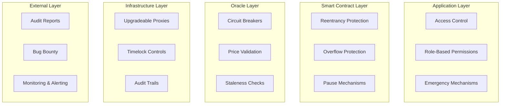

# Quantillon Protocol Security Guide

## Overview

The Quantillon Protocol implements comprehensive security measures to protect user funds and ensure protocol integrity. This document outlines security best practices, audit reports, and risk management guidelines.

---

## Security Architecture

### Multi-Layer Security Model



---

## Security Features

### 1. Access Control

**Role-Based Access Control (RBAC)**:
- Hierarchical permission system
- Principle of least privilege
- Time-locked administrative functions
- Multi-signature requirements for critical operations

**Key Roles**:
```solidity
bytes32 public constant DEFAULT_ADMIN_ROLE = 0x00;
bytes32 public constant EMERGENCY_ROLE = keccak256("EMERGENCY_ROLE");
bytes32 public constant GOVERNANCE_ROLE = keccak256("GOVERNANCE_ROLE");
bytes32 public constant VAULT_ROLE = keccak256("VAULT_ROLE");
bytes32 public constant YIELD_MANAGER_ROLE = keccak256("YIELD_MANAGER_ROLE");
bytes32 public constant COMPLIANCE_ROLE = keccak256("COMPLIANCE_ROLE");
bytes32 public constant LIQUIDATOR_ROLE = keccak256("LIQUIDATOR_ROLE");
bytes32 public constant TIME_MANAGER_ROLE = keccak256("TIME_MANAGER_ROLE");
```

### 2. Reentrancy Protection

**Implementation**:
- `nonReentrant` modifier on all state-changing functions
- Checks-effects-interactions pattern
- External call isolation
- State variable protection

**Example**:
```solidity
modifier nonReentrant() {
    require(_status != _ENTERED, "ReentrancyGuard: reentrant call");
    _status = _ENTERED;
    _;
    _status = _NOT_ENTERED;
}
```

### 3. Oracle Security

**Price Feed Validation**:
- Multiple price feed sources
- Staleness checks (max 1 hour)
- Price bound validation
- Circuit breaker mechanisms

**Implementation**:
```solidity
function validateOraclePrice(bool isValid) internal pure {
    if (!isValid) revert ErrorLibrary.StalePrice();
}

function validatePriceBounds(uint256 price) internal view {
    if (price < minPrice || price > maxPrice) {
        revert ErrorLibrary.InvalidPrice();
    }
}
```

### 4. Emergency Mechanisms

**Pause System**:
- Global pause functionality
- Role-based pause controls
- Emergency withdrawal capabilities
- Circuit breaker activation

**Implementation**:
```solidity
modifier whenNotPaused() {
    require(!paused(), "Pausable: paused");
    _;
}

function emergencyPause() external onlyRole(EMERGENCY_ROLE) {
    _pause();
    emit EmergencyPause(msg.sender, block.timestamp);
}
```

---

## Audit Reports

### Security Audit v1.0

**Auditor**: [Audit Firm Name]
**Date**: [Audit Date]
**Scope**: All smart contracts
**Status**: ✅ Completed

**Key Findings**:
- ✅ No critical vulnerabilities found
- ✅ No high-severity issues identified
- ⚠️ 3 medium-severity issues (resolved)
- ⚠️ 5 low-severity issues (resolved)
- ℹ️ 12 informational findings (addressed)

**Resolved Issues**:
1. **Gas Optimization**: Optimized storage layout and function calls
2. **Input Validation**: Enhanced parameter validation
3. **Event Logging**: Improved event emission for monitoring
4. **Error Handling**: Standardized error messages
5. **Documentation**: Enhanced NatSpec documentation

### Security Audit v1.1

**Auditor**: [Second Audit Firm]
**Date**: [Audit Date]
**Scope**: Updated contracts and new features
**Status**: 🔄 In Progress

**Focus Areas**:
- Yield management system
- Cross-contract interactions
- Governance mechanisms
- Oracle integration
- Emergency procedures

---

## Bug Bounty Program

### Program Details

**Reward Structure**:
- **Critical**: $100,000
- **High**: $50,000
- **Medium**: $10,000
- **Low**: $1,000
- **Informational**: $500

**Scope**:
- All smart contracts in the protocol
- Integration contracts
- Governance mechanisms
- Oracle systems

**Exclusions**:
- Issues in third-party dependencies
- Social engineering attacks
- Physical attacks
- Issues requiring admin privileges

### Submission Process

1. **Report**: Submit detailed vulnerability report
2. **Review**: Security team reviews submission
3. **Validation**: Reproduce and validate issue
4. **Fix**: Develop and deploy fix
5. **Reward**: Process bounty payment

**Contact**: security@quantillon.money

---

## Risk Management

### Risk Categories

#### 1. Smart Contract Risks

**Oracle Manipulation**:
- **Risk**: Price feed manipulation
- **Mitigation**: Multiple price sources, circuit breakers
- **Monitoring**: Price deviation alerts

**Reentrancy Attacks**:
- **Risk**: State manipulation during external calls
- **Mitigation**: Reentrancy guards, CEI pattern
- **Monitoring**: Function call analysis

**Access Control Bypass**:
- **Risk**: Unauthorized function execution
- **Mitigation**: Role-based access control, multi-sig
- **Monitoring**: Permission change alerts

#### 2. Economic Risks

**Liquidity Risk**:
- **Risk**: Insufficient liquidity for operations
- **Mitigation**: Liquidity requirements, emergency procedures
- **Monitoring**: Liquidity ratio tracking

**Interest Rate Risk**:
- **Risk**: Adverse interest rate movements
- **Mitigation**: Hedging mechanisms, rate limits
- **Monitoring**: Rate change alerts

**Market Risk**:
- **Risk**: Extreme market volatility
- **Mitigation**: Circuit breakers, position limits
- **Monitoring**: Volatility tracking

#### 3. Operational Risks

**Key Management**:
- **Risk**: Private key compromise
- **Mitigation**: Hardware security modules, multi-sig
- **Monitoring**: Access pattern analysis

**Upgrade Risk**:
- **Risk**: Malicious or faulty upgrades
- **Mitigation**: Timelock controls, governance
- **Monitoring**: Upgrade proposal tracking

**Integration Risk**:
- **Risk**: Third-party protocol failures
- **Mitigation**: Risk limits, emergency procedures
- **Monitoring**: External protocol health

---

## Security Best Practices

### For Developers

#### 1. Code Security

**Input Validation**:
```solidity
function deposit(uint256 amount) external {
    require(amount > 0, "Amount must be positive");
    require(amount <= MAX_DEPOSIT, "Amount exceeds limit");
    // ... function logic
}
```

**Access Control**:
```solidity
modifier onlyAuthorized() {
    require(hasRole(AUTHORIZED_ROLE, msg.sender), "Unauthorized");
    _;
}
```

**Reentrancy Protection**:
```solidity
function withdraw(uint256 amount) external nonReentrant {
    // ... function logic
}
```

#### 2. Testing

**Unit Testing**:
- Test all function paths
- Test edge cases and boundary conditions
- Test access control mechanisms
- Test error conditions

**Integration Testing**:
- Test contract interactions
- Test external integrations
- Test upgrade scenarios
- Test emergency procedures

**Fuzz Testing**:
- Random input generation
- Property-based testing
- Stress testing
- Gas limit testing

#### 3. Code Review

**Review Checklist**:
- [ ] Access control implementation
- [ ] Input validation
- [ ] Reentrancy protection
- [ ] Error handling
- [ ] Gas optimization
- [ ] Event emission
- [ ] Documentation

### For Integrators

#### 1. Integration Security

**Contract Verification**:
```javascript
// Verify contract addresses
const VAULT_ADDRESS = "0x..."; // Verified on Etherscan
const QEURO_ADDRESS = "0x..."; // Verified on Etherscan

// Verify contract state
const isPaused = await vault.paused();
if (isPaused) {
    throw new Error("Contract is paused");
}
```

**Transaction Security**:
```javascript
// Use slippage protection
const slippage = 0.05; // 5%
const minOutput = expectedOutput * (1 - slippage);

// Validate transaction parameters
const gasEstimate = await contract.estimateGas.function(params);
const gasLimit = gasEstimate.mul(120).div(100); // 20% buffer
```

**Error Handling**:
```javascript
try {
    await contract.function();
} catch (error) {
    if (error.message.includes('InsufficientBalance')) {
        // Handle insufficient balance
    } else if (error.message.includes('StalePrice')) {
        // Handle stale price
    } else {
        // Handle other errors
    }
}
```

#### 2. Monitoring

**Event Monitoring**:
```javascript
// Monitor important events
contract.on('QEUROMinted', (user, usdcAmount, qeuroAmount) => {
    console.log(`User ${user} minted ${qeuroAmount} QEURO`);
});

contract.on('EmergencyPause', (admin, timestamp) => {
    console.log(`Contract paused by ${admin} at ${timestamp}`);
});
```

**Health Checks**:
```javascript
async function healthCheck() {
    const [
        isPaused,
        oraclePrice,
        vaultMetrics
    ] = await Promise.all([
        vault.paused(),
        oracle.getEurUsdPrice(),
        vault.getVaultMetrics()
    ]);
    
    if (isPaused) {
        console.warn("Vault is paused");
    }
    
    if (!oraclePrice.isValid) {
        console.warn("Oracle price is stale");
    }
    
    if (vaultMetrics.collateralizationRatio < 11000) {
        console.warn("Low collateralization ratio");
    }
}
```

---

## Incident Response

### Response Procedures

#### 1. Detection

**Automated Monitoring**:
- Price deviation alerts
- Liquidity threshold alerts
- Access control violation alerts
- Unusual transaction pattern alerts

**Manual Monitoring**:
- Community reports
- Security researcher reports
- Internal security reviews
- External audit findings

#### 2. Assessment

**Severity Classification**:
- **Critical**: Immediate threat to user funds
- **High**: Significant risk to protocol integrity
- **Medium**: Moderate risk with workarounds
- **Low**: Minor issues with minimal impact

**Impact Analysis**:
- Affected contracts and functions
- Potential financial impact
- User impact assessment
- Recovery time estimation

#### 3. Response

**Immediate Actions**:
- Activate emergency pause if necessary
- Notify security team and stakeholders
- Assess and contain the issue
- Implement temporary mitigations

**Recovery Actions**:
- Develop and test fixes
- Deploy fixes through governance
- Monitor system recovery
- Conduct post-incident review

#### 4. Communication

**Stakeholder Notification**:
- Internal team notification
- Community announcement
- Partner notification
- Regulatory notification (if required)

**Transparency**:
- Incident timeline
- Root cause analysis
- Remediation steps
- Prevention measures

---

## Security Monitoring

### Real-Time Monitoring

**Key Metrics**:
- Contract pause status
- Oracle price staleness
- Liquidity ratios
- Access control changes
- Unusual transaction patterns

**Alerting**:
- Price deviation > 5%
- Liquidity ratio < 110%
- Emergency role activation
- Large transaction volumes
- Failed transaction spikes

### Security Dashboards

**Operational Dashboard**:
- System health indicators
- Performance metrics
- Error rates
- Gas usage patterns

**Security Dashboard**:
- Access control events
- Emergency activations
- Oracle health status
- Risk metrics

---

## Compliance and Regulatory

### Regulatory Compliance

**KYC/AML**:
- Compliance role management
- Address whitelist/blacklist
- Transaction monitoring
- Reporting capabilities

**Data Protection**:
- Privacy-preserving design
- Minimal data collection
- Secure data handling
- User consent management

### Audit Trail

**Transaction Logging**:
- All state changes logged
- Event emission for monitoring
- Immutable audit trail
- Compliance reporting

**Access Logging**:
- Role changes tracked
- Administrative actions logged
- Emergency activations recorded
- Governance decisions documented

---

## Security Roadmap

### Short Term (Q1 2025)

- [ ] Complete security audit v1.1
- [ ] Implement additional monitoring
- [ ] Enhance bug bounty program
- [ ] Deploy security dashboards

### Medium Term (Q2 2025)

- [ ] Formal verification for critical functions
- [ ] Advanced threat detection
- [ ] Cross-chain security measures
- [ ] Institutional security features

### Long Term (Q3 2025)

- [ ] Zero-knowledge proof integration
- [ ] Advanced MEV protection
- [ ] Decentralized security monitoring
- [ ] Automated response systems

---

## Security Contacts

### Primary Contacts

**Security Team**: security@quantillon.money
**Emergency Response**: emergency@quantillon.money
**Bug Bounty**: bounty@quantillon.money

### Community

**Discord**: [Security Channel](https://discord.gg/quantillon)
**Telegram**: [Security Group](https://t.me/quantillon)
**GitHub**: [Security Issues](https://github.com/Quantillon-Labs/smart-contracts/issues)

---

## Security Resources

### Documentation

- [Smart Contract Security Best Practices](https://consensys.github.io/smart-contract-best-practices/)
- [OpenZeppelin Security Guidelines](https://docs.openzeppelin.com/contracts/security)
- [Ethereum Security Considerations](https://ethereum.org/en/developers/docs/smart-contracts/security/)

### Tools

- [Slither Static Analysis](https://github.com/crytic/slither)
- [Mythril Symbolic Execution](https://github.com/ConsenSys/mythril)
- [Echidna Fuzzing](https://github.com/crytic/echidna)

### Auditors

- [Trail of Bits](https://www.trailofbits.com/)
- [ConsenSys Diligence](https://consensys.net/diligence/)
- [OpenZeppelin](https://openzeppelin.com/)

---

*This security guide is maintained by Quantillon Labs and updated regularly. Last updated: January 2025*
