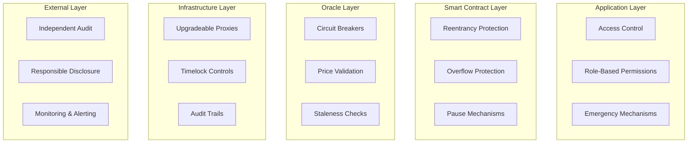

# Quantillon Protocol Security Guide

## Overview

The Quantillon Protocol implements comprehensive security measures to protect user funds and ensure protocol integrity. This document outlines security best practices, the vulnerability disclosure process, and risk management guidelines.

---

## Security Architecture

### Multi-Layer Security Model


```mermaid
graph TB
    subgraph "Application Layer"
        AC[Access Control]
        RB[Role-Based Permissions]
        EM[Emergency Mechanisms]
    end
    
    subgraph "Smart Contract Layer"
        RP[Reentrancy Protection]
        OV[Overflow Protection]
        PA[Pause Mechanisms]
    end
    
    subgraph "Oracle Layer"
        CB[Circuit Breakers]
        PV[Price Validation]
        SF[Staleness Checks]
    end
    
    subgraph "Infrastructure Layer"
        UP[Upgradeable Proxies]
        TL[Timelock Controls]
        AU[Audit Trails]
    end
    
    subgraph "External Layer"
        AE[Independent Audit]
        BB[Responsible Disclosure]
        MC[Monitoring & Alerting]
    end
```

---

## Security Features

### 1. Access Control

**Role-Based Access Control (RBAC)**:
- Hierarchical permission system
- Principle of least privilege
- Time-locked upgrades: the eight `SecureUpgradeable` core proxies (QuantillonVault, QEUROToken, QTIToken, UserPool, HedgerPool, YieldShift, stQEUROFactory, stQEUROToken) can only be upgraded through the 12 h OpenZeppelin `TimelockController`
- Multi-signature control: every privileged role is held by the 2-of-3 governance Safe. Parameter changes, and upgrades of the plain-UUPS FeeCollector / oracle / SlippageStorage proxies, execute as direct Safe transactions with no delay (see the governance-flow column of the [2026-08-26 bundle runbook](./Bundle-Release-2026-08-26.md))

**Key Roles per contract**:
```solidity
// QEUROToken
MINTER_ROLE       = keccak256("MINTER_ROLE");      // Vault: mint QEURO
BURNER_ROLE       = keccak256("BURNER_ROLE");      // Vault: burn QEURO
PAUSER_ROLE       = keccak256("PAUSER_ROLE");      // Emergency: pause token, minting killswitch
COMPLIANCE_ROLE   = keccak256("COMPLIANCE_ROLE");  // Blacklist/whitelist management

// QuantillonVault / QTIToken / UserPool / HedgerPool / YieldShift / stQEUROFactory / stQEUROToken
GOVERNANCE_ROLE         = keccak256("GOVERNANCE_ROLE");         // Parameter updates, wiring
EMERGENCY_ROLE          = keccak256("EMERGENCY_ROLE");          // Emergency pause/withdraw
VAULT_OPERATOR_ROLE     = keccak256("VAULT_OPERATOR_ROLE");     // Vault: external-vault USDC deployment
YIELD_DISTRIBUTOR_ROLE  = keccak256("YIELD_DISTRIBUTOR_ROLE");  // Vault: harvestAndDistributeVaultYield / creditVaultYield
VAULT_FACTORY_ROLE      = keccak256("VAULT_FACTORY_ROLE");      // stQEUROFactory: vault self-registration
// HedgerPool has no hedger role: it uses a single-hedger allowlist (setSingleHedger)

// FeeCollector
GOVERNANCE_ROLE   = keccak256("GOVERNANCE_ROLE");  // Ratios, fund addresses, fee sources, upgrades (plain UUPS)
TREASURY_ROLE     = keccak256("TREASURY_ROLE");    // distributeFees
FEE_SOURCE_ROLE   = keccak256("FEE_SOURCE_ROLE");  // Contracts allowed to push fees

// OracleRouter / ChainlinkOracle / HyperliquidEurUsdOracle / StorkOracle / LighterEurUsdOracle (inert)
ORACLE_MANAGER_ROLE = keccak256("ORACLE_MANAGER_ROLE"); // Feed/source updates, bounds, staleness, oracle switching
EMERGENCY_ROLE      = keccak256("EMERGENCY_ROLE");      // Circuit breakers, pause
UPGRADER_ROLE       = keccak256("UPGRADER_ROLE");       // Plain-UUPS upgrades (Safe direct, no timelock)

// SlippageStorage
MANAGER_ROLE        = keccak256("MANAGER_ROLE");        // Store configuration (sources, thresholds, intervals)
WRITER_ROLE         = keccak256("WRITER_ROLE");         // Publishing the venue mid on-chain
```

### 2. Reentrancy Protection

**Implementation**:
- `nonReentrant` modifier on all state-changing functions
- Checks-effects-interactions pattern
- External call isolation
- State variable protection

**Example**:
```solidity
// OpenZeppelin ReentrancyGuardUpgradeable: a re-entrant call reverts with ReentrancyGuardReentrantCall()
function redeemQEURO(uint256 qeuroAmount, uint256 minUsdcOut) external nonReentrant whenNotPaused {
    // ... function logic
}
```

### 3. Oracle Security

**Price Feed Validation**:
- Multiple price feed sources
- Staleness checks (Hyperliquid: 15 min; Chainlink EUR/USD: 2 h; USDC/USD: 25 h)
- Price bound validation
- Circuit breaker mechanisms

**Implementation**:
```solidity
// QuantillonVault: an invalid oracle read is a hard stop for mint / redeem
(uint256 price, bool isValid) = oracle.getEurUsdPrice();
if (!isValid) revert CommonErrorLibrary.InvalidOraclePrice();

// Oracles: staleness, bounds and deviation checks return isValid = false instead of
// reverting; governance setters validate inputs with CommonErrorLibrary.InvalidPrice()
```

### 4. Emergency Mechanisms

**Pause System**:
- Global pause functionality
- Role-based pause controls
- Emergency withdrawal capabilities
- Circuit breaker activation

**Implementation**:
```solidity
// OpenZeppelin PausableUpgradeable: `whenNotPaused` reverts with EnforcedPause()
function pause() external onlyRole(EMERGENCY_ROLE) {   // PAUSER_ROLE on QEUROToken
    _pause();                                          // emits Paused(msg.sender)
}
```

---

## Responsible Disclosure

### Reporting a vulnerability

Report suspected vulnerabilities privately to **team@quantillon.money** before any public disclosure. Include the affected contract(s) and addresses, a reproduction (transaction trace or Foundry test) and your assessment of impact. The team acknowledges reports, works with the reporter on validation and remediation, and coordinates publication once a fix is live.

**In scope**: all contracts under `src/` as deployed on Base mainnet (see the [API Reference](./API-Reference.md#contract-addresses)), including the oracle stack and the external vault adapters.
**Out of scope**: issues in third-party dependencies, social engineering, and scenarios that require already-privileged roles.

### Bug bounty

A bug bounty program is **planned**; reward tiers and scope will be published on this page when it opens. Until then, reports are handled through the disclosure process above.

### Audits

The protocol underwent an independent security audit; the resulting on-chain remediation went live in July 2026.

---

## Risk Management

### Risk Categories

#### 1. Smart Contract Risks

**Oracle Manipulation**:
- **Risk**: Price feed manipulation
- **Mitigation**: Multiple price sources, circuit breakers
- **Monitoring**: Price deviation alerts

**Reentrancy Attacks**:
- **Risk**: State manipulation during external calls
- **Mitigation**: Reentrancy guards, CEI pattern
- **Monitoring**: Function call analysis

**Access Control Bypass**:
- **Risk**: Unauthorized function execution
- **Mitigation**: Role-based access control, multi-sig
- **Monitoring**: Permission change alerts

#### 2. Economic Risks

**Liquidity Risk**:
- **Risk**: Insufficient liquidity for operations
- **Mitigation**: Liquidity requirements, emergency procedures
- **Monitoring**: Liquidity ratio tracking

**Interest Rate Risk**:
- **Risk**: Adverse interest rate movements
- **Mitigation**: Hedging mechanisms, rate limits
- **Monitoring**: Rate change alerts

**Market Risk**:
- **Risk**: Extreme market volatility
- **Mitigation**: Circuit breakers, position limits
- **Monitoring**: Volatility tracking

#### 3. Operational Risks

**Key Management**:
- **Risk**: Private key compromise
- **Mitigation**: Hardware security modules, multi-sig
- **Monitoring**: Access pattern analysis

**Upgrade Risk**:
- **Risk**: Malicious or faulty upgrades
- **Mitigation**: Timelock controls, governance
- **Monitoring**: Upgrade proposal tracking
- **Version traceability**: every core contract exposes `IVersioned.version()` and any change is traced through a semver bump (CI-enforced via `make check-version-bump`); `deployments/{chainId}/versions.json` records the live implementation + commit per contract, so an auditor can confirm exactly which source version is deployed (`cast call <proxy> "version()(string)"`).
- **Known limitation (tracked 2026-07-15)**: `SecureUpgradeable.setTimelock` is `DEFAULT_ADMIN_ROLE`-gated but not itself timelocked, so an admin can repoint a proxy at a shorter-delay TimelockController and bypass the intended upgrade window — the same window `toggleSecureUpgrades(false)` deliberately protects behind the quorum-gated, 24h emergency-disable flow. Close by routing `setTimelock` through the active timelock (or the emergency-disable flow) in the next `SecureUpgradeable` revision; until then, treat any `TimelockSet` event on a live proxy as a critical alert.

**Integration Risk**:
- **Risk**: Third-party protocol failures
- **Mitigation**: Risk limits, emergency procedures
- **Monitoring**: External protocol health

---

## Security Best Practices

### For Developers

#### 1. Code Security

**Input Validation**:
```solidity
function deposit(uint256 amount) external {
    if (amount == 0) revert CommonErrorLibrary.InvalidAmount();
    if (amount > MAX_DEPOSIT) revert CommonErrorLibrary.AboveLimit();
    // ... function logic
}
```

**Access Control**:
```solidity
// Role checks use OpenZeppelin AccessControl (`onlyRole`) or the shared library helpers,
// which revert with custom errors (e.g. CommonErrorLibrary.NotGovernance / NotAuthorized)
function setParameter(uint256 value) external onlyRole(GOVERNANCE_ROLE) {
    // ... function logic
}
```

**Reentrancy Protection**:
```solidity
function withdraw(uint256 amount) external nonReentrant {
    // ... function logic
}
```

#### 2. Testing

**Unit Testing**:
- Test all function paths
- Test edge cases and boundary conditions
- Test access control mechanisms
- Test error conditions

**Integration Testing**:
- Test contract interactions
- Test external integrations
- Test upgrade scenarios
- Test emergency procedures

**Fuzz Testing**:
- Random input generation
- Property-based testing
- Stress testing
- Gas limit testing

#### 3. Code Review

**Review Checklist**:
- [ ] Access control implementation
- [ ] Input validation
- [ ] Reentrancy protection
- [ ] Error handling
- [ ] Gas optimization
- [ ] Event emission
- [ ] Documentation

### For Integrators

#### 1. Integration Security

**Contract Verification**:
```javascript
// Verify contract addresses
const VAULT_ADDRESS = "0x..."; // Verified on Etherscan
const QEURO_ADDRESS = "0x..."; // Verified on Etherscan

// Verify contract state
const isPaused = await vault.paused();
if (isPaused) {
    throw new Error("Contract is paused");
}
```

**Transaction Security**:
```javascript
// Use slippage protection
const slippage = 0.05; // 5%
const minOutput = expectedOutput * (1 - slippage);

// Validate transaction parameters
const gasEstimate = await contract.estimateGas.function(params);
const gasLimit = gasEstimate.mul(120).div(100); // 20% buffer
```

**Error Handling**:
```javascript
try {
    await contract.function();
} catch (error) {
    const msg = error.reason || error.message;
    if (msg.includes('InsufficientBalance') || msg.includes('ERC20InsufficientBalance')) {
        // Handle insufficient balance
    } else if (msg.includes('InvalidOraclePrice')) {
        // Handle stale / invalid oracle price
    } else if (msg.includes('EnforcedPause')) {
        // Handle paused contract
    } else {
        // Handle other errors
    }
}
```

#### 2. Monitoring

**Event Monitoring**:
```javascript
// Monitor important events (QEUROminted: lowercase m, 3 arguments)
vault.on('QEUROminted', (user, usdcAmount, qeuroAmount) => {
    console.log(`User ${user} minted ${qeuroAmount} QEURO`);
});

// Pause is the OpenZeppelin Pausable event
vault.on('Paused', (account) => {
    console.log(`Contract paused by ${account}`);
});
```

**Health Checks**:
```javascript
async function healthCheck() {
    const [isPaused, [price, isValid], collateralizationRatio, mintFloor, criticalRatio] = await Promise.all([
        vault.paused(),
        oracleRouter.callStatic.getEurUsdPrice(),   // non-view: simulate instead of sending a tx
        vault.getProtocolCollateralizationRatio(),   // 18-decimal percent, 1e20 == 100% (0 while nothing is minted)
        vault.minCollateralizationRatioForMinting(), // 1.025e20 live (102.5%)
        vault.criticalCollateralizationRatio()       // 1.01e20 (101%)
    ]);

    if (isPaused) {
        console.warn("Vault is paused");
    }

    if (!isValid) {
        console.warn("Oracle price is stale or invalid");
    }

    if (collateralizationRatio.lt(mintFloor)) {
        console.warn("Protocol CR below the minting floor: mints are refused");
    }

    if (collateralizationRatio.lte(criticalRatio)) {
        console.error("Protocol CR at or below the critical ratio: liquidation-mode redemptions");
    }
}
```

---

## Incident Response

### Response Procedures

#### 1. Detection

**Automated Monitoring**:
- Price deviation alerts
- Liquidity threshold alerts
- Access control violation alerts
- Unusual transaction pattern alerts

**Manual Monitoring**:
- Community reports
- Security researcher reports
- Internal security reviews
- External audit findings

#### 2. Assessment

**Severity Classification**:
- **Critical**: Immediate threat to user funds
- **High**: Significant risk to protocol integrity
- **Medium**: Moderate risk with workarounds
- **Low**: Minor issues with minimal impact

**Impact Analysis**:
- Affected contracts and functions
- Potential financial impact
- User impact assessment
- Recovery time estimation

#### 3. Response

**Immediate Actions**:
- Activate emergency pause if necessary
- Notify security team and stakeholders
- Assess and contain the issue
- Implement temporary mitigations

**Recovery Actions**:
- Develop and test fixes
- Deploy fixes through governance
- Monitor system recovery
- Conduct post-incident review

#### 4. Communication

**Stakeholder Notification**:
- Internal team notification
- Community announcement
- Partner notification
- Regulatory notification (if required)

**Transparency**:
- Incident timeline
- Root cause analysis
- Remediation steps
- Prevention measures

---

## Security Monitoring

### Real-Time Monitoring

**Key Metrics**:
- Contract pause status
- Oracle price staleness
- Liquidity ratios
- Access control changes
- Unusual transaction patterns

**Alerting**:
- Price deviation > 5%
- Protocol collateralization ratio below the governance-set minting floor (`minCollateralizationRatioForMinting`: 105% at launch, 102.5% under the September 2026 margin policy; liquidation mode at <= 101%)
- Emergency role activation
- Large transaction volumes
- Failed transaction spikes

### Security Dashboards

**Operational Dashboard**:
- System health indicators
- Performance metrics
- Error rates
- Gas usage patterns

**Security Dashboard**:
- Access control events
- Emergency activations
- Oracle health status
- Risk metrics

---

## Security Contacts

### Primary Contacts

**Security contact**: team@quantillon.money — vulnerability reports and responsible disclosure (see [Responsible Disclosure](#responsible-disclosure))

---

## Security Resources

### Documentation

- [Smart Contract Security Best Practices](https://consensys.github.io/smart-contract-best-practices/)
- [OpenZeppelin Security Guidelines](https://docs.openzeppelin.com/contracts/security)
- [Ethereum Security Considerations](https://ethereum.org/en/developers/docs/smart-contracts/security/)

### Tools

- [Slither Static Analysis](https://github.com/crytic/slither)
- [Mythril Symbolic Execution](https://github.com/ConsenSys/mythril)
- [Echidna Fuzzing](https://github.com/crytic/echidna)

### Security Analysis Results

Use generated artifacts from each run instead of hardcoded snapshots:

- `scripts/results/slither/slither-report.txt`
- `scripts/results/slither/slither-report.json`
- `scripts/results/mythril-reports/`
- `scripts/results/natspec-validation-report.txt`
- `scripts/results/contract-sizes/contract-sizes-summary.txt`

**Running Mythril Analysis**:
```bash
# Run Mythril analysis
make mythril

# Or run directly
./scripts/run-mythril.sh

# Run Slither static analysis
make slither

# Validate NatSpec coverage
make validate-natspec

# Run EIP-170 contract size checks
make analyze-contract-sizes

# Run comprehensive security analysis (Slither + Mythril)
make security
```


---

*This security guide is maintained by Quantillon Labs and updated regularly.*
